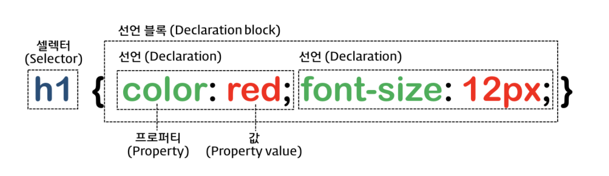

  CSS h3 { color:green; } /\* 기본 선택자 중에서 아이디>클래스>태그 순으로 우선순위가 정해져 있음. #tb1 { color:deeppink; } .table { color:brown; } table { color:navy; } 그러므로 우선순위는 ① #tb1 ② .table ③ table 순이다. .wrap p { font-size:24px; } .wrap p::first-line { color:red; } .wrap p::first-letter { font-size:60px; } .wrap p::selection { background-color:yellow; } .ck + label { transition:0.8s; font-size:28px; color:black; } .ck:checked + label { font-size:40px; color:blue; } .ck:not(:checked) + label { font-size:14px; color:red; } \*/ .wrap { width:1200px; margin:20px auto; } 

CSS
===

CSS(Cascading Style Sheet) 라고도 하며, 줄여서 스타일(Style)이라고도 한다.

Cascading(계단식) Style(모양) Sheet(기록패널)

* * *

1\. CSS 적용 방법
-------------

*   ### 외부 스타일(External Style)
    
    별도의 css 파일을 생성하여 여러 HTML 문서에서 link 요소로 적용하는 방법
    
                        <link rel="stylesheet" href="서식파일이름.css">
                    
    
*   ### 내부 스타일(Internal Style)
    
    현재 문서에 있는 요소(Element)에만 스타일을 적용하는 방법
    
    현재 문서 내 style 요소의 안에 스타일 내용을 기재하는 방법
    
                        
                    
    
*   ### 인라인 스타일(Inline Style)
    
    해당 요소에 직접 스타일을 적용하는 방법
    
    해당 요소에 style 속성(attribute)에 직접 지정하는 방법으로서 재사용성이 가장 좋지 않지만, 다른 스타일 지정 방식보다는 우선 순위가 가장 빠르다.
    
                        <h3 style="color:red">제목</h3>
                    
    

* * *

2\. 스타일 기본 문법
-------------

* * *

CSS 선택자(Selector)
-----------------

CSS 스타일을 부여할 대상 요소

선택자 이름

선택자 문법

설명

예시

전체 선택자

\* { }

모든 요소(Element)를 스타일을 부여할 대상으로 선택

\* { margin:0; padding:0; }

태그 선택자

tagname { }

특정 요소(Element)를 스타일 부여 대상으로 선택

h3 { color:blue }

클래스 선택자

.클래스명 { }

특정 클래스가 있는 요소(Element)를 스타일 부여 대상으로 선택

.dp1 { text-align:center; }

아이디 선택자

#아이디명 { }

특정 아이디가 지정된 요소(Element)를 스타일 부여 대상으로 선택

#hd { width:1200px; }

복수 선택자

선택자1, 선택자2 { }

여러 요소를 한 번에 스타일을 부여할 대상으로 선택

h1,h2,h3 { font-size:14px; }

속성 선택자

\[속성명\] { }

해당 속성(태그속성)이 존재하는 요소를 스타일 부여할 대상으로 선택

\[href\] { text-decoration:none; }

속성 일치 선택자

\[속성명="값"\] { }

해당 속성(태그속성)의 값이 지정한 값과 일치하는 요소를 스타일 부여할 대상으로 선택

\[target="\_blank"\] { text-decoration:none; }

속성 접두 선택자

\[속성명^="값"\] { }

해당 속성(태그속성)의 값이 지정한 값으로 시작하는 요소를 스타일 부여할 대상으로 선택

img\[src^="kim"\] { border:3px; }

속성 접미 선택자

\[속성명$="값"\] { }

해당 속성(태그속성)의 값이 지정한 값으로 끝나는 요소를 스타일 부여할 대상으로 선택

\[src$=".jpg"\] { border:5px solid red; }

속성 포함 선택자

\[속성명\*="값"\] { }  

해당 속성(태그속성)의 값이 지정한 값을 포함하는 요소를 스타일 부여할 대상으로 선택

\[src\*="dall"\] { border:5px solid red; }

부모자식 선택자

elem1 > elem2 { }  

elem1의 안에 있는 elem2 자식 요소를 스타일 부여할 대상으로 선택

#lst > li { }

조상후손 선택자

elem1 elem2 { }  

elem1의 안에 있는 elem2 후손 요소를 스타일 부여할 대상으로 선택

#lst li { }

동생(next) 선택자

elem1 + elem2 { }  

elem1의 바로 다음에 나오는 elem2 동생 요소 하나만을 스타일 부여할 대상으로 선택

.first + li { }

동생들(nextAll) 선택자

elem1 ~ elem2 { }  

elem1의 다음에 나오는 elem2 동생들 요소를 스타일 부여할 대상으로 선택

.first ~ li { }

자기 자신 선택자

elem1elem2 { }  

elem1과 elem2가 모두 만족하는 요소를 스타일 부여할 대상으로 선택

.sub.mid { }

링크 선택자

:link { }  

href 속성이 있는 요소를 스타일 부여할 대상으로 선택

a:link { }

방문 했던 요소 선택자

:visited { }  

href 속성의 값이 방문했던 적이 있는 주소이면 스타일 부여할 대상으로 선택

a:visited { }

롤오버 선택자

:hover { }  

해당 요소에 마우스 포인터를 올리면 그 요소를 스타일 부여할 대상으로 선택

.box:hover { }

셀렉트 선택자

:active { }  

해당 요소에 마우스 포인터를 올리고 클릭하고 있으면, 그 요소를 스타일 부여할 대상으로 선택

.box:active { }

커서 선택자

:focus { }  

해당 요소에 커서가 옮겨지면, 그 요소를 스타일 부여할 대상으로 선택

input:focus { }

체크 선택자

:checked { }  

해당 체크박스나 라디오 버튼 요소에 체크를 하면, 그 요소를 스타일 부여할 대상으로 선택

input:checked { }

폼 유효성 선택자

:invalid { }  

해당 폼 요소의 유효성 검사시 유효하지 않은 데이터 입력시에 그 요소를 스타일 부여할 대상으로 선택

input:invalid { }

사용 가능한 폼 요소 선택자

:enabled { }  

해당 폼 요소 중에서 사용이 가능한 요소를 스타일 부여할 대상으로 선택

input:enabled { }

사용 불가능한 폼 요소 선택자

:disabled { }  

해당 폼 요소 중에서 사용이 불가능한 요소를 스타일 부여할 대상으로 선택

input:disabled { }

첫째 선택자

elem:first-child { }  

해당 요소 중에서 첫 번째 요소를 스타일 부여할 대상으로 선택

li:first-child { }

첫째 요소 선택자

elem:first-of-type { }  

첫 번째 요소 중에서 해당 요소를 스타일 부여할 대상으로 선택

li:first-of-type { }

마지막 선택자

elem:last-child { }  

해당 요소 중에서 마지막 번째 요소를 스타일 부여할 대상으로 선택

li:last-child { }

마지막 요소 선택자

elem:last-of-type { }  

마지막 번째 요소 중에서 해당 요소를 스타일 부여할 대상으로 선택

li:last-of-type { }

특정 번째 선택자

elem:nth-child(위치숫자) { }  

해당 요소 중에서 특정 번째 요소를 스타일 부여할 대상으로 선택

li:nth-child(2) { }  
li:nth-child(2n)  
li:nth-child(even)  
li:nth-child(2n+1)  
li:nth-child(odd)

특정 번째 요소 선택자

elem:nth-of-type(위치숫자) { }  

특정 번째 요소 중에서 해당 요소를 스타일 부여할 대상으로 선택

li:nth-of-type(2) { }

하나 뿐인 요소 선택자

elem:only-child { }  

특정 요소가 하나만 존재하는 요소를 스타일 부여할 대상으로 선택

li:only-child { }

자식이 없는 요소 선택자

elem:empty { }  

해당 요소 중에서 비어 있는 요소를 스타일 부여할 대상으로 선택

li:empty { }

이전 영역 선택자

elem:before { }  

해당 요소의 안쪽에서 그 앞을 스타일 부여할 대상으로 선택

li:before { content:"앞 "; }

다음 영역 선택자

elem:after { }  

해당 요소의 안쪽에서 그 뒤를 스타일 부여할 대상으로 선택

li:after { content:"뒤 "; }

첫 줄 선택자

elem::first-line { }  

해당 요소의 첫 번째 줄을 스타일 부여할 대상으로 선택

.wrap p::first-line { color:red; }

첫 글자 선택자

elem::first-letter { }  

해당 요소의 첫 글자를 스타일 부여할 대상으로 선택

.wrap p::first-letter { font-size:60px; }

글자/문단 범위 선택자

elem::selection { }  

해당 요소의 글자의 범위를 선택하면, 그 범위 안에 있는 글자를 스타일을 부여할 대상으로 선택

.wrap p::selection { background-color:yellow; }

부정 선택자

elem:not(조건) { }  

해당 요소의 주어진 조건이 만족되지 않는 요소를 스타일을 부여할 대상으로 선택

.ck:not(:checked) + label { font-size:14px; color:red; }

### 스타일 선택자 사용 주의 사항

*   선택자의 우선 순위는 아이디 > 클래스 > 태그 순이다.
    
*   단계적으로 선택자를 기입하되, 단순한 선택자 부터 기입하고, 복잡한 선택자를 아래에 배치한다.
    
*   범위가 크거나 부모의 선택부터 하고, 그 다음에 범위가 작거나 세밀한 선택을 하도록 해야 한다.
    
*   아이디는 한 문서 내에서 중복되어서는 안된다.
    
*   같은 서식이 부여되는 경우는 가급적 클래스를 활용하여 같은 서식을 부여하도록 한다.
    

  
  

* * *

  

3\. CSS 속성 - Background
-----------------------

속성명

도메인

설명

예시

background-color

transparent | 컬러명 | RGB HEX(3/6) | RGB(0-255,0-255,0-255) | HSL(Hue,Sturation%,Lightness%)

배경색을 지정하는 속성

background-color:#000  
background-color:#000000  
background-color:black  
background-color:rgb(0,0,0)  
background-color:rgba(0,0,0,1)  
background-color:hsl(240,0%,0%)  
background-color:hsla(240,0%,0%,1)

background-image

none | url(이미지경로)

배경 이미지를 지정하는 속성

background-image:url(./images/ive.png), url(./images/jungle.jpg)

background-repeat

repeat | repeat-x | repeat-y | no-repeat

배경이미지의 반복 속성

background-image:url(./images/ive.png), url(./images/jungle.jpg)

background-position

가로위치 세로위치로 지정하되, 0 0 | top | bottom | left | right | middle | 숫자(+/-)px/%

배경이미지 위치 지정 속성

background-position:left bottom  
background-position:-200px -100px

background-attachment

scroll | fixed | local

배경이미지 고정 유무 지정 속성

background-attachment:fixed

background-origin

padding-box | border-box | content-box

배경이미지의 원점 기준 지정 속성

background-origin:content-box

background-size

auto | 가로크기 세로크기 | cover | contain

배경이미지의 크기 지정 속성

background-size:100px 200px, 200px 400px

background-clip

padding-box | border-box | content-box

배경이미지의 영역을 어디까지 표시할지 지정 속성

background-clip:border-box

background

bg-color bg-image position/bg-size bg-repeat bg-origin bg-clip bg-attachment

배경에 모든 세부속성을 한 꺼번에 지저하는 통합 속성

background-clip:border-box

filter

blur(px) &| brightness(%) &| contrast(%) &| grayscale(%) &| invert(%) &| opcacity(%) &| saturate(%) &| sepia(%) &| drop-shadow(x y blur px) &| hue-rotate(deg)

배경이나 이미지에 필터 효과를 적용하는 속성

filter:blur(3px) hue-rotate(45deg) opacity(85%)

  
  

* * *

  

4\. CSS 속성 - 글자/문단 속성
---------------------

속성명

도메인

설명

예시

@font-face

@font-face { font-family:"폰트별칭"; src:url(폰트파일이름을포함한웹폰트의경로); }

웹페이지에서 적용할 폰트를 규정하는 규칙

@font-face { font-family:"ntg"; url(./font/notosans.woff); }

font-famliy

font-family:"폰트별칭"\[, 대체폰트1, 기본웹폰트\];

폰트 규칙(@font-face) 에서 규정한 폰트를 적용하는 속성. 기본웹폰트에는 serif(명조), sans-serif(고딕), cursive(궁서), fantasy(장식), monospace(장평같음)

.con { font-family:"ntg", sans-serif; }

color

color:색상명 | HEX(3/6) | rgb | rgba | hsl | hsla

글자색을 지정하는 속성으로 16진수 HEX code와 여러 색 함수를 활용할 수 있음.

.con { color:deepskyblue; }  
.con strong { color:#333; }

font-size

font-size: initial | xx-small | x-small | small | medium | large | x-large | xx-large | px, cm, em, %, rem 단위

글자크기를 지정하는 속성으로 크기를 나타내는 키워드 또는 크기단위로 지정할 수 있음.

.con { font-size:14px; }  
.con strong { font-size:1.5em; }

font-weight

font-weight: normal | bold | bolder | lighter | 100 | 200 | 300 | 400 | 500 | 600 | 700 | 800 | 900

글자 두께를 지정하는 속성으로 크기를 100부터 900까지 100단위로 지정할 수 있으며, 해당 키워드도 가능함.

.con { font-size:14px; }  
.con strong { font-size:1.5em; }

font-style

font-style: normal | italic | oblique

기울임꼴을 지정하는 속성

.con { font-style:italic; }  
.con strong { font-style:normal; }

font-variant

font-variant: normal | small-caps

대소문자가 있는 알파벳 계열에서 대소문자의 크기가 서로 달라서 대문자를 소문자 크기로 변경하기 위한 속성

.con { font-variant:small-caps; }  
.con strong { font-variant:normal; }

font-stretch

font-stretch: normal | ultra-condensed | extra-condensed | condensed | semi-condensed | semi-expanded | expanded | extra-expanded | ultra-expanded

글자의 장평(높이와 폭의 비율) 지정하기 위한 속성

.con { font-stretch:condensed; }  
.con strong { font-stretch:expanded; }

line-height

line-height: normal | 숫자 | px, % 단위

한 행의 높이를 지정하기 위한 속성으로 블록요소에 지정

.con { line-height:2; }  
.con strong { line-height:30px; }

word-spacing

word-spacing: normal | px,pt,cm,em 단위

어간(단어와 단어 사이의 간격)을 지정하기 위한 속성

.con { word-spacing:10px; }  
.con strong { word-spacing:normal; }

letter-spacing

letter-spacing: normal | px,pt,cm,em 단위

자간(글자와 글자 사이의 간격)을 지정하기 위한 속성

.con { letter-spacing:10px; }  
.con strong { letter-spacing:-2px; }

text-align

text-align: left | right | center | justify

글자 정렬을 의미하며, 블록요소에 지정하는 속성

.con { text-align:center; }  
.con strong { text-align:left; }

text-decoration

text-decoration: none | underline | overline | line-through

글자나 특정 단어에 줄을 적용할 때 지정하는 속성

.con { text-decoration:none; }  
.con strong { text-decoration:underline; }

text-indent

text-indent: %, px, pt, cm, em 단위

들여쓰기(+)/내어쓰기(-)를 지정하는 속성

.con1 { text-indent:20px; }  
.con2 { text-indent:-20px; }

text-transform

text-transform: none | uppercase | lowercase | capitalize

영문계열의 문자를 대/소문자로 변환해주는 속성

.con1 { text-transform:uppercase; }  
.con2 { text-transform:capitalize; }

text-orientation

text-orientation: mixed | upright | sideways | sideways-right | use-glyph-orientation

문단의 글자 읽는 진행방향을 설정해주는 속성

.con1 { text-orientation:upright; }  
.con2 { text-orientation:sideways; }

direction

direction: ltr | rtl

글자의 진행 방향을 지정하는 속성

.con1 { direction: rtl; }

writing-mode

writing-mode: horizontal-tb | sideways-lr | sideways-rl | vertical-rl | vertical-lr

글자의 표시 방향을 지정하는 속성

.con1 { writing-mode: sideways-rl; }

word-break

word-break: normal | break-all | keep-all | break-word

줄 끝에 도달했을 때 단어가 어떻게 끊어져야 하는지를 지정하는 속성

.con1 { word-break:break-all; }  
.con2 { word-break:keep-all; }

word-wrap

word-wrap: normal | break-word

긴 단어를 나누어 다음 줄로 넘길 수 있도록 지정하는 속성

.con1 { word-break:break-word; }  
.con2 { word-break:normal; }

white-space

white-space: normal | nowrap | pre | pre-line | pre-wrap

요소 내부의 공백을 처리하는 방법을 지정하는 속성

.con1 { white-space:nowrap; }  
.con2 { white-space:pre; }

text-overflow

text-overflow: clip | ellipsis | string

영역의 크기에 비해 흘러 넘치는 텍스트를 어떻게 처리할지 지정하는 속성

.con1 { text-overflow:clip; }  
.con2 { text-overflow:ellipsis; }

text-shadow

text-shadow: none | h-shadow v-shadow blur-radius color

텍스트에 그림자를 지정하는 속성

.con1 { text-shadow:2px 2px 8px #ff0000; }  
.con2 { text-shadow:-3px -3px 4px #00ff00; }

  
  

* * *

  

5\. CSS 속성 - 출력 및 크기에 영향을 주는 속성(Boxing Properties)
--------------------------------------------------

속성명

도메인

설명

예시

display

display : block | inline | inline-block | none

콘텐츠의 출력 방식을 지정하는 속성

display:block;

opacity

opacity : 0~1 숫자

콘텐츠 요소의 불투명도를 지정하는 속성

opcity:0.5;

visibility

visibility : visible | hidden | collapse

콘텐츠의 보일지 숨길지를 지정하는 속성

visibility:hidden  
display:none은 출력을 하지 않으므로 크기가 설정되지 않지만,  
visibility:hidden은 보이지 않을 뿐 크기가 지정되어 그 자리를 차지하고 있음.

width

width : auto | %, px, cm, vw 단위

콘텐츠 요소의 너비를 지정하는 속성

width:100%;

height

height : auto | %, px, cm, vh 단위

콘텐츠 요소의 높이를 지정하는 속성

height:100vh;

margin

margin: auto | %, px, cm 단위

박스의 바깥 여백를 지정하는 속성

margin:25px;  
margin:20px auto;  
margin:10px 20px 30px 40px;

margin-top

margin-top: auto | %, px, cm 단위

박스 바깥의 위 여백를 지정하는 통합 속성

margin-top:25px;

margin-right

margin-right: auto | %, px, cm 단위

박스 바깥의 오른쪽 여백를 지정하는 세부 속성

margin-right:40%;

margin-bottom

margin-bottom: auto | %, px, cm 단위

박스 바깥의 아래 여백를 지정하는 세부 속성

margin-bottom:10px;

margin-left

margin-left: auto | %, px, cm 단위

박스 바깥의 왼쪽 여백를 지정하는 세부 속성

margin-left:40px;

padding

padding: auto | %, px, cm, em(rem) 단위

박스의 안 여백를 지정하는 통합 속성

padding:25px;  
padding:20px auto;  
padding:10px 20px 30px 40px;

padding-top

padding-top: auto | %, px, cm, em(rem) 단위

박스 안의 위 여백를 지정하는 세부 속성

padding-top:1rem;

padding-right

padding-right: auto | %, px, cm, em(rem) 단위

박스 안의 오른쪽 여백를 지정하는 세부 속성

padding-right:10px;

padding-bottom

padding-bottom: auto | %, px, cm, em(rem) 단위

박스 안의 아래 여백를 지정하는 세부 속성

padding-bottom:5%;

padding-left

padding-left: auto | %, px, cm, em(rem) 단위

박스 안의 왼쪽 여백를 지정하는 속성

padding-left:14px;

border

border: px/pt크기 선모양 선색상

박스의 테두리를 지정하는 통합 속성

border:2px solid #333;  
border:2px solid #333, 4px dashed #f00;

border-width

border-width: px/pt크기

박스의 테두리 두께를 지정하는 세부 속성

border-width:2px;  
border-width:2px 4px;

border-style

border-style: none | hidden | dotted | dashed | solid | double | groove | ridge | inset | outset

박스의 테두리 선 모양을 지정하는 세부 속성

border-style:solid;  
border-style:solid dotted dashed hidden;

border-color

border-color: 컬러명 | RGB HEX(3/6) | RGB() | RGBA() | HSL() | HSLA()

박스의 테두리 선 색상을 지정하는 세부 속성

border-color:red;  
border-color:navy blue gold orange;

border-top

border-top: px/pt크기 선모양 선색상

박스의 위 테두리를 지정하는 세부 속성

border-top:2px solid #333;

border-right

border-right: px/pt크기 선모양 선색상

박스의 오른쪽 테두리를 지정하는 세부 속성

border-right:2px solid #333;

border-bottom

border-bottom: px/pt크기 선모양 선색상

박스의 아래 테두리를 지정하는 세부 속성

border-bottom:2px solid #333;

border-left

border-left: px/pt크기 선모양 선색상

박스의 왼쪽 테두리를 지정하는 세부 속성

border-left:2px solid #333;

border 세세속성

border-방향-width/style/color

박스의 테두리를 방향과 그 방향의 테두리 두께, 모양, 색상을 하나 하나 세부적으로 지정하는 세세속성

border-left-style:solid;

border-raduis

border-radius: px, %, em 단위 숫자

박스의 모서리 둥글기를 지정하는 속성

border-radius:10px;  
border-radius:10px 30px;  
border-radius:10px 20px 30px 40px;

box-sizing

box-sizing: content-box | border-box

박스에 지정된 크기를 어디까지의 값으로 계산할지 설정하는 속성

border-box:border-box;

overflow

overflow: visible | hidden | auto | scroll

지정된 박스크기를 벗어난 흘러 넘친 콘텐츠를 어떻게 처리할지 설정하는 속성

overflow:auto;

overflow-x

overflow-x: visible | hidden | auto | scroll

지정된 박스 가로크기를 벗어난 흘러 넘친 콘텐츠를 어떻게 처리할지 설정하는 속성

overflow-x:hidden;

overflow-x

overflow-y: visible | hidden | auto | scroll

지정된 박스 세로크기를 벗어난 흘러 넘친 콘텐츠를 어떻게 처리할지 설정하는 속성

overflow-y:scroll;

  
  

* * *

  

6\. CSS 속성 - 배치와 관련된 속성(Locational Properties)
----------------------------------------------

속성명

도메인

설명

예시

position

position : static | absolute | relative | fixed | sticky

콘텐츠 배치 방법을 지정하는 속성

position:relative;

float

float : none | left | right

한 행에 여러 콘텐츠를 배치할 경우 그 흐름의 방향을 지정하는 속성

float:left;

clear

clear : none | left | right | both

흐름의 방향을 지정하는 float 속성을 해체할 경우 설정하는 속성

clear:both;

top

top : auto | px, %, em, vh 단위 숫자

맨 위로 부터 떨어진 위치를 지정하는 속성

top:50px;

bottom

bottom : auto | px, %, em, vh 단위 숫자

맨 아래 바닥으로 부터 떨어진 위치를 지정하는 속성

bottom:15px;

left

left : auto | px, %, em, vw 단위 숫자

맨 왼쪽 시작부터 떨어진 위치를 지정하는 속성

left:3%;

right

right : auto | px, %, em, vw 단위 숫자

맨 오른쪽 끝 부터 떨어진 위치를 지정하는 속성

right:2%;

z-index

z-index : auto | 숫자

콘텐츠들이 겹칠 경우 레이어(우선순위)번호를 지정하는 속성

z-index:99;

※ position이 static이거나 relative인 경우는 margin, float, clear 속성을 활용하여 배치한다.

※ position이 absolute이거나 fixed인 경우는 left/right 중에서 하나의 속성만 이용하여 가로의 위치를 설정하고, top/bottom 중에서 하나의 속성을 이용하여 세로의 위치를 설정한다.

※ position이 absolute이거나 fixed인 경우는 여러 콘텐츠를 겹칠 수 있어 겹칠 경우 z-index의 값을 조절하여 지정하되, 앞으로 올라올 콘텐츠에는 z-index의 값을 큰수로 한다.

※ position이 absolute이면, body 요소를 기준으로 기준점이 잡히기 때문에 위치기준이 문서의 처음의 맨 위 상단으로 하므로, 부모 요소에 relative를 적용하면, 부모를 기준으로 기준점을 지정할 수 있다.

  
  

* * *

  

7\. CSS 속성 - 기타 속성
------------------

속성명

도메인

설명

예시

list-style

list-style : none | list-style-type list-style-position list-style-image

목록의 기호를 설정하는 속성

list-style:none

list-style-type

list-style-type : none | disc | armenian | circle | decimal | georgian | hebrew | hiragana | katakana | lower-alpha | lower-greek | lower-latin | lower-roman | square | upper-alpha | upper-greek | upper-latin | upper-roman

목록 기호의 종류를 지정하는 속성

list-style-type: disc;

list-style-position

list-style-position: inside | outside

목록 기호의 위치를 설정하는 속성

list-style-position: inside

list-style-image

list-style-image: none | url

목록 기호의 이미지를 지정하는 속성

top:50px;

cursor

cursor : default | alias | all-scroll | auto | cell | col-resize | context-menu | crosshair | copy | e-resize | ew-resize | grab | grabbing | help | move | n-resize | ne-resize | nesw-resize | ns-resize | nw-resize | nwse-resize | no-drop | none | not-allowed | pointer | progress | row-resize | s-resize | se-resize | sw-resize | text | vertical-text | w-resize | wait | zoom-in | zoom-out

마우스 포인터 모양을 지정하는 속성

cursor:pointer;

  
  

* * *