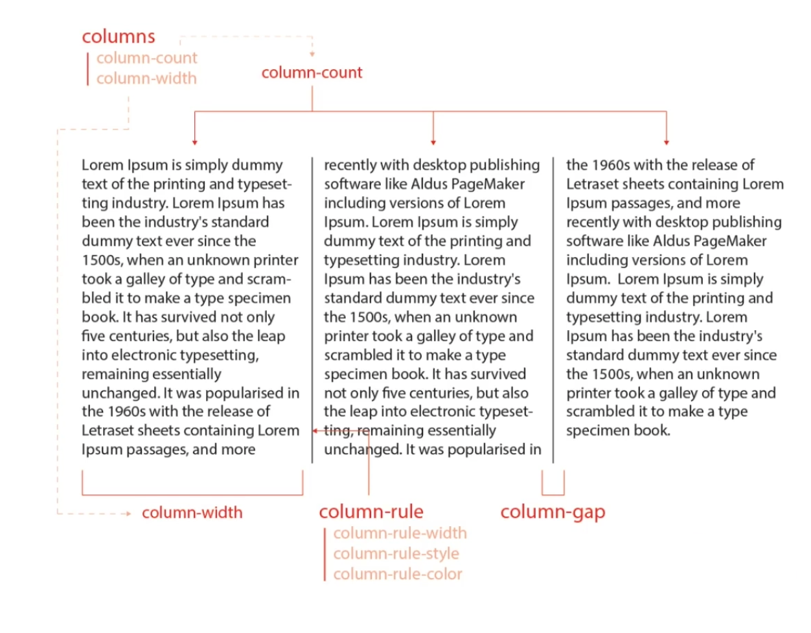

# CSS 란?

- CSS(Cascading Style Sheet) 라고도 하며, 줄여서 스타일(Style)이라고도 한다.
- Cascading(계단식) Style(모양) Sheet(기록패널) 이라는 뜻으로 스타일 지정시 선택자를 범위를 큰 것에서 부터 작은 순으로 지정을 계단식으로 한다고 해서 붙여진 이름입니다.

------------------------------------------------------------------------

<br><br>

## 1. CSS 적용 방법과 기본 문법

### 1-1. 외부 스타일(External Style)

- 별도의 css 파일을 생성하여 여러 HTML 문서에서 link 요소로 적용하는 방법
```html
    <link rel="stylesheet" href="서식파일이름.css">
```

<br><br>

### 1-2. 내부 스타일(Internal Style)

- 현재 문서에 있는 요소(Element)에만 스타일을 적용하는 방법
- 현재 문서 내 style 요소의 안에 스타일 내용을 기재하는 방법
```html
    <style>
    /* 내부 스타일 */    
    </style>
```
<br><br>

### 1-3. 인라인 스타일(Inline Style)

- 해당 요소에 직접 스타일을 적용하는 방법
- 해당 요소에 style 속성(attribute)에 직접 지정하는 방법으로서 재사용성이 가장 좋지 않지만, 다른 스타일 지정 방식보다는 우선 순위가 가장 빠르다.

```html
    <h3 style="color:red">제목</h3>
```

------------------------------------------------------------------------

<br><br>

### 1-4. CSS 기본 문법


<br>

------------------------------------------------------------------------

<br><hr><br>

## 2. CSS 선택자


| 선택자 이름 | 선택자 문법 | 설명 | 예시 |
|--------------|----------------|------------------------------------------------------------------------------------------|-------------------------|
| 전체 선택자 | * { } | 모든 요소(Element)를 스타일을 부여할 대상으로 선택 | * { margin:0; padding:0; } | 
| 태그 선택자 | tagname { }  | 특정 요소(Element)를 스타일 부여 대상으로 선택 | h3 { color:blue } | 
| 클래스 선택자 | .클래스명 { } | 특정 클래스가 있는 요소(Element)를 스타일 부여 대상으로 선택 | .dp1 { text-align:center; } | 
| 아이디 선택자 | #아이디명 { } | 특정 아이디가 지정된 요소(Element)를 스타일 부여 대상으로 선택 | #hd { width:1200px; } | 
| 복수 선택자 | 선택자1, 선택자2 { } | 여러 요소를 한 번에 스타일을 부여할 대상으로 선택 | h1,h2,h3 { font-size:14px; } | 
| 속성 선택자 | [속성명] { } | 해당 속성(태그속성)이 존재하는 요소를 스타일 부여할 대상으로 선택 | [href] { text-decoration:none; } | 
| 속성 일치 선택자 | [속성명="값"] { } | 해당 속성(태그속성)의 값이 지정한 값과 일치하는 요소를 스타일 부여할 대상으로 선택 | [target="_blank"] { text-decoration:none; } | 
| 속성 접두 선택자 | [속성명^="값"] { } | 해당 속성(태그속성)의 값이 지정한 값으로 시작하는 요소를 스타일 부여할 대상으로 선택 | img[src^="kim"] { border:3px; } | 
| 속성 접미 선택자 | [속성명$="값"] { } | 해당 속성(태그속성)의 값이 지정한 값으로 끝나는 요소를 스타일 부여할 대상으로 선택 | [src$=".jpg"] { border:5px solid red; } | 
| 속성 포함 선택자 | [속성명*="값"] { }<br> | 해당 속성(태그속성)의 값이 지정한 값을 포함하는 요소를 스타일 부여할 대상으로 선택 | [src*="dall"] { border:5px solid red; } | 
| 부모자식 선택자 | elem1 > elem2 { }<br> | elem1의 안에 있는 elem2 자식 요소를 스타일 부여할 대상으로 선택 | #lst > li {  } | 
| 조상후손 선택자 | elem1 elem2 { }<br> | elem1의 안에 있는 elem2 후손 요소를 스타일 부여할 대상으로 선택 | #lst li {  } | 
| 동생(next) 선택자 | elem1 + elem2 { }<br> | elem1의 바로 다음에 나오는 elem2 동생 요소 하나만을 스타일 부여할 대상으로 선택 | .first + li { } | 
| 동생들(nextAll) 선택자 | elem1 ~ elem2 { }<br> | elem1의 다음에 나오는 elem2 동생들 요소를 스타일 부여할 대상으로 선택 | .first ~ li { } | 
| 자기 자신 선택자 | elem1elem2 { }<br> | elem1과 elem2가 모두 만족하는 요소를 스타일 부여할 대상으로 선택 | .sub.mid { } | 
| 링크 선택자 | :link { }<br> | href 속성이 있는 요소를 스타일 부여할 대상으로 선택 | a:link { } | 
| 방문 했던 요소 선택자 | :visited { }<br> | href 속성의 값이 방문했던 적이 있는 주소이면 스타일 부여할 대상으로 선택 | a:visited { } | 
| 롤오버 선택자 | :hover { }<br> | 해당 요소에 마우스 포인터를 올리면 그 요소를 스타일 부여할 대상으로 선택 | .box:hover { } | 
| 셀렉트 선택자 | :active { }<br> | 해당 요소에 마우스 포인터를 올리고 클릭하고 있으면, 그 요소를 스타일 부여할 대상으로 선택 | .box:active { } | 
| 커서 선택자 | :focus { }<br> | 해당 요소에 커서가 옮겨지면, 그 요소를 스타일 부여할 대상으로 선택 | input:focus { } | 
| 체크 선택자 | :checked { }<br> | 해당 체크박스나 라디오 버튼 요소에 체크를 하면, 그 요소를 스타일 부여할 대상으로 선택 | input:checked { } | 
| 폼 유효성 선택자 | :invalid { }<br> | 해당 폼 요소의 유효성 검사시 유효하지 않은 데이터 입력시에 그 요소를 스타일 부여할 대상으로 선택 | input:invalid { } | 
| 사용 가능한 폼 요소 선택자 | :enabled { }<br> | 해당 폼 요소 중에서 사용이 가능한 요소를 스타일 부여할 대상으로 선택 | input:enabled { } | 
| 사용 불가능한 폼 요소 선택자 | :disabled { }<br> | 해당 폼 요소 중에서 사용이 불가능한 요소를 스타일 부여할 대상으로 선택 | input:disabled { } | 
| 첫째 선택자 | elem:first-child { }<br> | 해당 요소 중에서 첫 번째 요소를 스타일 부여할 대상으로 선택 | li:first-child { } | 
| 첫째 요소 선택자 | elem:first-of-type { }<br> | 첫 번째 요소 중에서 해당 요소를 스타일 부여할 대상으로 선택 | li:first-of-type { } | 
| 마지막 선택자 | elem:last-child { }<br> | 해당 요소 중에서 마지막 번째 요소를 스타일 부여할 대상으로 선택 | li:last-child { } | 
| 마지막 요소 선택자 | elem:last-of-type { }<br> | 마지막 번째 요소 중에서 해당 요소를 스타일 부여할 대상으로 선택 | li:last-of-type { } | 
| 특정 번째 선택자 | elem:nth-child(위치숫자) { }<br> | 해당 요소 중에서 특정 번째 요소를 스타일 부여할 대상으로 선택 | li:nth-child(2) { }<br>li:nth-child(2n)<br>li:nth-child(even)<br>li:nth-child(2n+1)<br>li:nth-child(odd) | 
| 특정 번째 요소 선택자 | elem:nth-of-type(위치숫자) { }<br> | 특정 번째 요소 중에서 해당 요소를 스타일 부여할 대상으로 선택 | li:nth-of-type(2) { } | 
| 하나 뿐인 요소 선택자 | elem:only-child { }<br> | 특정 요소가 하나만 존재하는 요소를 스타일 부여할 대상으로 선택 | li:only-child { } | 
| 자식이 없는 요소 선택자 | elem:empty { }<br> | 해당 요소 중에서 비어 있는 요소를 스타일 부여할 대상으로 선택 | li:empty { } | 
| 이전 영역 선택자 | elem:before { }<br> | 해당 요소의 안쪽에서 그 앞을 스타일 부여할 대상으로 선택 | li:before { content:"앞 "; } | 
| 다음 영역 선택자 | elem:after { }<br> | 해당 요소의 안쪽에서 그 뒤를 스타일 부여할 대상으로 선택 | li:after { content:"뒤 "; } | 
| 첫 줄 선택자 | elem::first-line { }<br> | 해당 요소의 첫 번째 줄을 스타일 부여할 대상으로 선택 | .wrap p::first-line { color:red; } | 
| 첫 글자 선택자 | elem::first-letter { }<br> | 해당 요소의 첫 글자를 스타일 부여할 대상으로 선택 | .wrap p::first-letter { font-size:60px; } | 
| 글자/문단 범위 선택자 | elem::selection { }<br> | 해당 요소의 글자의 범위를 선택하면, 그 범위 안에 있는 글자를 스타일을 부여할 대상으로 선택 | .wrap p::selection { background-color:yellow; } | 
| 부정 선택자 | elem:not(조건) { }<br> | 해당 요소의 주어진 조건이 만족되지 않는 요소를 스타일을 부여할 대상으로 선택 | .ck:not(:checked) + label { font-size:14px; color:red; } | 


### ※ 스타일 선택자 사용 주의 사항

- 선택자의 우선 순위는 아이디 > 클래스 > 태그 순이다.
- 단계적으로 선택자를 기입하되, 단순한 선택자 부터 기입하고, 복잡한 선택자를 아래에 배치한다.
- 범위가 크거나 부모의 선택부터 하고, 범위가 작거나 세밀한 선택을 하도록 해야 한다.
- 아이디는 한 문서 내에서 중복되어서는 안된다.
- 같은 서식이 부여되는 경우는 가급적 클래스를 활용하여 같은 서식을 부여하도록 한다.

<br><br>


<br><br>

### 2-1. CSS 선택자 실습 예시 코드

```html
<!DOCTYPE html>
<html lang="en">
<head>
    <meta charset="UTF-8">
    <meta name="viewport" content="width=device-width, initial-scale=1.0">
    <title>CSS 선택자 실습</title>
    <style>
    .container { clear:both; width:1200px; margin:20px auto; }    
    #con1 h2 { color:red; }
    .container h2 { color:blue; }
    #con1.container h2 { color:purple; }
    .container p { color:#333; font-weight:bold; }
    div h2 { color:green; }    

    #con2 img { display:inline-block; width:200px; height:300px; }
    #con2 img[src] { border-style:solid; border-width:10px; }
    #con2 img[src="b.jpg"] { border-style:dotted; }
    #con2 img[src^="a"] { border-style:dashed; }
    #con2 img[src$=".png"] { border-color:red; }
    #con2 img[src$=".jpg"] { border-color:green; }
    #con2 img[src$=".gif"] { border-color:blue; }

    #con3 ul { list-style:none; }
    #con3 > ul { width:960px; height:500px; border:1px solid #333; }
    #con3 .mid + li { color:red; }
    #con3 .mid ~ li { text-decoration: underline; }

    .box_area { clear:both; width: 100%; }
    .box { display:block; width:100px; height:100px; margin:20px; 
        border:4px solid #333; float:left; text-decoration:none; 
        text-align:center; line-height: 100px; font-size:28px; 
        font-weight:700; text-shadow:1px 1px 1px #333; }
    .box:link { border-color:red; }    
    .box:visited { color:gold;  }
    .box:hover { background-color:#ccc; }
    .box:active { background-color:gold; }

    #con5 { clear:both; }
    #con5 input, #con5 label { display:block; width:300px; line-height:40px; 
        color:#333; font-size:24px; }
    #con5 input:focus { color:red; }
    #con5 input:enabled { border:3px solid blue; }
    #con5 input:disabled { border:3px solid red; }
    #ck1:checked + label { color:deepskyblue; }
    #ck1:not(:checked) + label { color:deeppink; }

    #con6 ul { list-style: none; }
    #con6 li { font-size:24px; }
    #con6 .sub li:first-child { color:red; }
    #con6 .sub li:nth-child(2) { color:blue; }
    #con6 .sub li:last-child { color:green; }
    #con6 .sub li:only-child { color:gold; }
    #con6 .sub li:empty { width:200px; height:200px; background-color:cyan; }

    #con6 .sub .mid:first-of-type { background-color:deeppink; }
    #con6 .sub .mid:last-of-type { background-color:deepskyblue; }
    #con6 .sub .mid:nth-of-type(2) { background-color:silver; }

    .contents { width:900px; } 
    .contents::before { content:"\0022"; font-size:50px; color:deeppink}
    .contents::after { content:"\0022"; font-size:50px; color:deepskyblue}
    .contents::first-line { color:red; }
    .contents::first-letter { background-color:red; color:#fff; font-size:70px; }
    .contents::selection { background-color:gold; }
    </style>
</head>
<body>
    <h1 style="text-align: center;">CSS 선택자</h1>
    <hr>
    <div class="container" id="con1">
        <h2>CSS 기본 선택자</h2>
        <p>기본 선택자인 아이디, 클래스, 태그 중에서 가장 우선순위가 높은 것은 아이디 선택자입니다.</p>
        <p>아이디 > 클래스 > 태그 순임.</p>
        <p>아이디(금메달), 클래스(은메달), 태그(동메달)</p>
    </div>
    <hr>
    <div class="container" id="con2">
        <h2>CSS 속성 선택자</h2>
        <p>태그의 속성에서 만족한 것을 선택하는 선택자</p>
        
        
        
        
    </div>
    <hr>
    <div class="container" id="con3">
        <h2>CSS 계층 선택자</h2>
        <p>조상 후손 => #con3 ul<br>
           부모 > 자식 => #con3 > ul<br>
           형 + 아우 => #con3 .mid + li<br>
           형 ~ 아우들 => #con3 .mid ~ li<br>
        </p>
        <ul class="main">
            <li>메인1
                <ul class="sub">
                    <li>서브1</li>
                    <li class="mid">서브2</li>
                    <li>서브3</li>
                    <li>서브4</li>
                </ul>
            </li>
            <li>메인2
                <ul class="sub">
                    <li>서브1</li>
                    <li>서브2</li>
                    <li>서브3</li>
                    <li>서브4</li>
                </ul>
            </li>
            <li>메인3
                <ul class="sub">
                    <li>서브1</li>
                    <li>서브2</li>
                    <li>서브3</li>
                    <li>서브4</li>
                </ul>
            </li>
        </ul>
    </div>
    <hr>
    <div class="container" id="con4">
        <h2>가상 선택자1</h2>
        <p>:link(href속성이 있는), :visited(방문했던), :hover(마우스포인터를 올리면), :active(마우스로클릭하고있으면)</p>
        <div class="box_area">
            <div class="box">박스1</div>
            <div class="box">박스2</div>
            <div class="box">박스3</div>
            <div class="box">박스4</div>
            <div class="box">박스5</div>
            <div class="box">박스6</div>
        </div>
        <div class="box_area">
            <a href="http://www.naver.com" class="box">네이버</a>
            <a class="box">빈칸</a>
            <a href="http://www.google.com" class="box">구글</a>
            <a href="http://www.seoul.go.kr" class="box">서울</a>
            <a href="#hd" class="box">HEAD</a>
            <a class="box">빈칸</a>
        </div>
    </div>
    <hr>
    <div class="container" id="con5">
        <h2>가상선택자2 - 폼요소의 상태 선택자</h2>
        <p>:focus, :checked, :disabled, :enabled, :invalid</p>
        <input type="text" name="id" id="id" placeholder="아이디 입력"><br>
        <input type="password" name="id" id="id" placeholder="비밀번호 입력"><br>
        <input type="text" name="name" id="name" value="김기태" disabled><br>
        <input type="checkbox" name="ck1" id="ck1" checked>
        <label for="ck1">체크1</label><br><br>
    </div>
    <div class="container" id="con6">
        <h2>CSS 순서 위치 선택자</h2>
        <p>첫 째 => :first-child, :first-of-type<br>
           마지막 번째 => :last-child, :last-of-type<br>
           특정 번째 => :nth-child(n), nth-of-type(n)<br>
           혼자인 요소 => :only-child, :only-of-type<br>
           비어 있는 요소 => :empty<br>
        </p>
        <ul class="main">
            <li>메인1
                <ul class="sub">
                    <li>서브1</li>
                    <li class="mid">서브2</li>
                    <li>서브3</li>
                    <li>서브4</li>
                </ul>
            </li>
            <li>메인2
                <ul class="sub">
                    <li>서브1</li>
                    <li>서브2</li>
                    <li class="mid">서브3</li>
                    <li>서브4</li>
                </ul>
            </li>
            <li>메인3
                <ul class="sub">
                    <li>서브1</li>
                    <li>서브2</li>
                    <li>서브3</li>
                    <li class="mid">서브4</li>
                </ul>
            </li>
            <li>메인4
                <ul class="sub">
                    <li>서브1</li>
                    <li></li>
                    <li>서브3</li>
                    <li class="mid">서브4</li>
                </ul>
            </li>
            <li>메인5
                <ul class="sub">
                    <li>서브1</li>
                </ul>
            </li>
            <li>메인6</li>
        </ul>
    </div>
    <hr>
    <div class="container" id="con7">
        <h2>가상 선택자4</h2>
        <p>:before, :after, ::first-line, ::first-letter, ::selection</p>
        <p class="contents">국회의원은 현행범인인 경우를 제외하고는 회기중 국회의 동의없이 체포 또는 구금되지 아니한다. 형사피의자 또는 형사피고인으로서 구금되었던 자가 법률이 정하는 불기소처분을 받거나 무죄판결을 받은 때에는 법률이 정하는 바에 의하여 국가에 정당한 보상을 청구할 수 있다. 이 헌법은 1988년 2월 25일부터 시행한다. 다만, 이 헌법을 시행하기 위하여 필요한 법률의 제정·개정과 이 헌법에 의한 대통령 및 국회의원의 선거 기타 이 헌법시행에 관한 준비는 이 헌법시행 전에 할 수 있다.</p>
        <p class="contents">누구든지 체포 또는 구속을 당한 때에는 적부의 심사를 법원에 청구할 권리를 가진다. 언론·출판은 타인의 명예나 권리 또는 공중도덕이나 사회윤리를 침해하여서는 아니된다. 언론·출판이 타인의 명예나 권리를 침해한 때에는 피해자는 이에 대한 피해의 배상을 청구할 수 있다. 환경권의 내용과 행사에 관하여는 법률로 정한다.</p>
        <p class="contents">통신·방송의 시설기준과 신문의 기능을 보장하기 위하여 필요한 사항은 법률로 정한다. 국회나 그 위원회의 요구가 있을 때에는 국무총리·국무위원 또는 정부위원은 출석·답변하여야 하며, 국무총리 또는 국무위원이 출석요구를 받은 때에는 국무위원 또는 정부위원으로 하여금 출석·답변하게 할 수 있다.</p>
        <p class="contents">법관이 중대한 심신상의 장해로 직무를 수행할 수 없을 때에는 법률이 정하는 바에 의하여 퇴직하게 할 수 있다. 대법원장과 대법관이 아닌 법관은 대법관회의의 동의를 얻어 대법원장이 임명한다. 대통령은 법률이 정하는 바에 의하여 사면·감형 또는 복권을 명할 수 있다. 모든 국민은 근로의 의무를 진다. 국가는 근로의 의무의 내용과 조건을 민주주의원칙에 따라 법률로 정한다.</p>
        <p class="contents">모든 국민은 직업선택의 자유를 가진다. 이 헌법시행 당시에 이 헌법에 의하여 새로 설치될 기관의 권한에 속하는 직무를 행하고 있는 기관은 이 헌법에 의하여 새로운 기관이 설치될 때까지 존속하며 그 직무를 행한다. 원장은 국회의 동의를 얻어 대통령이 임명하고, 그 임기는 4년으로 하며, 1차에 한하여 중임할 수 있다.</p>
    </div>
</body>
</html>
```

<br><hr><br>

### 2-2. CSS 속성 치트 시트


<br><hr><br>

## 3. CSS 속성 - Background

| 속성명 | 도메인 | 설명 | 예시
|------------|--------------------------------------------------|------------------------------------|-----------------------------|
| background-color	 | transparent &#124; 컬러명 &#124; RGB HEX(3/6) &#124; RGB(0-255,0-255,0-255) &#124; HSL(Hue,Sturation%,Lightness%) | 배경색을 지정하는 속성 | background-color:#000<br>background-color:#000000<br>background-color:black<br>background-color:rgb(0,0,0)<br>background-color:rgba(0,0,0,1)<br>background-color:hsl(240,0%,0%)<br>background-color:hsla(240,0%,0%,1) |
| background-image | none &#124; url(이미지경로) | 배경 이미지를 지정하는 속성 | background-image:url(./images/ive.png), url(./images/jungle.jpg) |
| background-repeat | repeat &#124; repeat-x &#124; repeat-y &#124; no-repeat | 배경이미지의 반복 속성 | background-image:url(./images/ive.png), url(./images/jungle.jpg) |
| background-position | 가로위치 세로위치로 지정하되, 0 0 &#124; top &#124; bottom &#124; left &#124; right &#124; middle &#124; 숫자(+/-)px/% | 배경이미지 위치 지정 속성 | background-position:left bottom<br> background-position:-200px -100px |
| background-attachment | scroll &#124; fixed &#124; local | 배경이미지 고정 유무 지정 속성 | background-attachment:fixed |
| background-origin | padding-box &#124; border-box &#124; content-box	배경이미지의 원점 기준 지정 속성 | background-origin:content-box |
| background-size | auto &#124; 가로크기 세로크기 &#124; cover &#124; contain | 배경이미지의 크기 지정 속성 | background-size:100px 200px, 200px 400px |
| background-clip | padding-box &#124; border-box &#124; content-box | 배경이미지의 영역을 어디까지 표시할지 지정 속성 | background-clip:border-box |
| background | bg-color bg-image position/bg-size bg-repeat bg-origin bg-clip bg-attachment | 배경에 모든 세부속성을 한 꺼번에 지정하는 통합 속성 | background-clip:border-box |
| filter | blur(px) &#38;&#124; brightness(%) &#38;&#124; contrast(%) &#38;&#124; grayscale(%) &#38;&#124; invert(%) &#38;&#124; opcacity(%) &#38;&#124; saturate(%) &#38;&#124; sepia(%) &#38;&#124; drop-shadow(x y blur px) &#38;&#124; hue-rotate(deg) | 배경이나 이미지에 필터 효과를 적용하는 속성 | filter:blur(3px) hue-rotate(45deg) opacity(85%) |

<br><br>

### 3-1. 실습 예시 코드

```html
<!DOCTYPE html>
<html lang="en">
<head>
    <meta charset="UTF-8">
    <meta name="viewport" content="width=device-width, initial-scale=1.0">
    <title>배경</title>
    <style>
    * { margin: 0; padding: 0; }
    .page { clear:both; width: 100vw; height: 100vh; 
        border-bottom:50px solid rgba(240,240,240,0.6); 
        border-top:50px solid rgba(18,18,18,0.6); box-sizing:border-box; 
        padding:5rem; }
    /* clear-fix */
    .page::after { content:""; display:block; width: 100%; clear:both; }    
    .page_title { padding-top:0.5rem; padding-bottom:0.25rem; 
        text-align:center; font-size:60px; }
    .comment { padding:2rem 10rem; font-size:20px; }    
    #page1 { background-color:deepskyblue; }
    #page2 { background: linear-gradient(to bottom,  #a90329 0%,#54000c 100%); }
    #page2 .page_title { color:#fff; }
    #page3 { background-color: transparent; /* 배경투명 */ }
    #page4 { background-image:url("./img/jen1.png"), url("./img/bts.jpg"); 
    background-size:auto auto, 100% auto; background-repeat:no-repeat; 
    background-position:center bottom; }
    #page5 { background-image:url("./img/jen1.png"), url("./img/bts.jpg"); 
    background-size:auto,auto; background-repeat:no-repeat, repeat;  }
    #page6 { background-image:url("./img/jen1.png"), url("./img/bts.jpg"); 
     background-repeat:no-repeat, repeat-y;  background-color:deeppink; }
    #page7 { background-image:url("./img/jen1.png"), url("./img/bts.jpg"); 
    background-size:auto auto, 100% auto; background-repeat:no-repeat; 
    background-position:center bottom; background-attachment:fixed, scroll; }
    #page8 { background-image:url("./img/jen1.png"), url("./img/bts.jpg"); 
    background-size:auto auto, 100% auto; background-repeat:no-repeat; 
    background-position:center bottom; background-attachment:fixed, scroll; 
    background-origin:content-box; }
    #page9 { background-image:url("./img/jen1.png"), url("./img/bts.jpg"); 
    background-size:auto auto, 100% auto; background-repeat:no-repeat; 
    background-position:center bottom; background-attachment:fixed, scroll; 
    background-origin:content-box; background-clip: content-box; }
    #page10 { background-image:url("./img/jen1.png"), url("./img/bg_section0_v3.jpg"); 
    background-size:300px auto, cover; background-repeat:no-repeat; 
    background-position:center bottom; }

    .tit_box { clear:both; }
    .tit_box:after { content:""; display:block; width:100%; clear:both; }
    .tit { display:block; width:400px; height:40px; margin:5px 80px; border:3px solid transparent; 
    font-size:30px; float:left; }
    .img_box { background-image:url("./img/jen1.png"); 
    background-size:cover; width:400px; height:600px; float:left; 
    margin:80px; 
    border:3px solid #333; }

    #page11 .img_box.item1 { filter:blur(0px); }
    #page11 .img_box.item2 { filter:blur(5px); }
    #page11 .img_box.item3 { filter:blur(20px); }

    #page12 .img_box.item1 { filter:brightness(100%); }
    #page12 .img_box.item2 { filter:brightness(150%); }
    #page12 .img_box.item3 { filter:brightness(50%); }

    #page13 .img_box.item1 { filter:contrast(100%); }
    #page13 .img_box.item2 { filter:contrast(150%); }
    #page13 .img_box.item3 { filter:contrast(50%); }

    #page14 .img_box.item1 { filter:grayscale(0%); }
    #page14 .img_box.item2 { filter:grayscale(100%); }
    #page14 .img_box.item3 { filter:grayscale(50%); }

    #page15 .img_box.item1 { filter:invert(0%); }
    #page15 .img_box.item2 { filter:invert(100%); }
    #page15 .img_box.item3 { filter:invert(70%); }

    #page16 .img_box.item1 { filter:opacity(100%); }
    #page16 .img_box.item2 { filter:opacity(30%); }
    #page16 .img_box.item3 { filter:opacity(70%); }

    #page17 .img_box.item1 { filter:saturate(100%); }
    #page17 .img_box.item2 { filter:saturate(30%); }
    #page17 .img_box.item3 { filter:saturate(160%); }

    #page18 .img_box.item1 { filter:sepia(0%); }
    #page18 .img_box.item2 { filter:sepia(50%); }
    #page18 .img_box.item3 { filter:sepia(100%); }
    
    #page19 .img_box.item1 { background-color:none; }
    #page19 .img_box.item2 { filter:drop-shadow(-5px -5px 50px blue); }
    #page19 .img_box.item3 { filter:drop-shadow(0px -20px 100px red); }   

    #page20 .img_box.item1 { background-color:none; }
    #page20 .img_box.item2 { filter:hue-rotate(180deg) }
    #page20 .img_box.item3 { filter:hue-rotate(45deg); }   
    </style>
</head>
<body>
    <section class="page" id="page1">
        <h2 class="page_title">제목1</h2>
        <p class="comment">#page1 { background-color:deepskyblue; }</p>
    </section>
    <section class="page" id="page2">
        <h2 class="page_title">제목2</h2>
        <p class="comment" style="color:#fff">#page2 { background: linear-gradient(to bottom,  #a90329 0%,#54000c 100%); }</p>
    </section>
    <section class="page" id="page3">
        <h2 class="page_title">제목3</h2>
        <p class="comment">#page3 { background-color: transparent; /* 배경투명 */ }</p>
    </section>
    <section class="page" id="page4">
        <h2 class="page_title">제목4</h2>
        <p class="comment">#page4 { background-image:url("./img/jen1.png"), url("./img/bts.jpg"); 
            background-size:auto auto, 100% auto; background-repeat:no-repeat; 
            background-position:center bottom; }</p>
    </section>
    <section class="page" id="page5">
        <h2 class="page_title">제목5</h2>
        <p class="comment">#page5 { background-image:url("./img/jen1.png"), url("./img/bts.jpg"); 
            background-size:auto,auto; background-repeat:no-repeat, repeat;  }</p>
    </section>
    <section class="page" id="page6">
        <h2 class="page_title">제목6</h2>
        <p class="comment">#page6 { background-image:url("./img/jen1.png"), url("./img/bts.jpg"); 
            background-repeat:no-repeat, repeat-y;  background-color:deeppink; }</p>
    </section>
    <section class="page" id="page7">
        <h2 class="page_title">제목7</h2>
        <p class="comment">#page7 { background-image:url("./img/jen1.png"), url("./img/bts.jpg"); 
            background-size:auto auto, 100% auto; background-repeat:no-repeat; 
            background-position:center bottom; background-attachment:fixed, scroll; }</p>
    </section>
    <section class="page" id="page8">
        <h2 class="page_title">제목8</h2>
        <p class="comment">#page8 { background-image:url("./img/jen1.png"), url("./img/bts.jpg"); 
            background-size:auto auto, 100% auto; background-repeat:no-repeat; 
            background-position:center bottom; background-attachment:fixed, scroll; 
            background-origin:content-box; }
            </p>
    </section>
    <section class="page" id="page9">
        <h2 class="page_title">제목9</h2>
        <p class="comment">#page9 { background-image:url("./img/jen1.png"), url("./img/bts.jpg"); 
            background-size:auto auto, 100% auto; background-repeat:no-repeat; 
            background-position:center bottom; background-attachment:fixed, scroll; 
            background-origin:content-box; background-clip: content-box; }
            </p>
    </section>
    <section class="page" id="page10">
        <h2 class="page_title">제목10</h2>
        <p class="comment">#page10 { background-image:url("./img/jen1.png"), url("./img/bg_section0_v3.jpg"); 
            background-size:300px auto, cover; background-repeat:no-repeat; 
            background-position:center bottom; }</p>
    </section>
    <section class="page" id="page11">
        <h2 class="page_title">Blur 필터</h2>
        <p class="comment">흐림 효과</p>
        <div class="tit_box">
            <h3 class="tit">blur(0px)</h3>
            <h3 class="tit">blur(5px)</h3>
            <h3 class="tit">blur(20px)</h3>
        </div>
        <div class="img_box item1"></div>
        <div class="img_box item2"></div>
        <div class="img_box item3"></div>
    </section>
    <section class="page" id="page12">
        <h2 class="page_title">Brightness</h2>
        <p class="comment">명도</p>
        <div class="tit_box">
            <h3 class="tit">brightness(100%)</h3>
            <h3 class="tit">brightness(150%)</h3>
            <h3 class="tit">brightness(50%)</h3>
        </div>
        <div class="img_box item1"></div>
        <div class="img_box item2"></div>
        <div class="img_box item3"></div>
    </section>
    <section class="page" id="page13">
        <h2 class="page_title">Contrast</h2>
        <p class="comment">빛 노출정도</p>
        <div class="tit_box">
            <h3 class="tit">contrast(100%)</h3>
            <h3 class="tit">contrast(150%)</h3>
            <h3 class="tit">contrast(50%)</h3>
        </div>
        <div class="img_box item1"></div>
        <div class="img_box item2"></div>
        <div class="img_box item3"></div>
    </section>
    <section class="page" id="page14">
        <h2 class="page_title">Grayscale</h2>
        <p class="comment">회색조</p>
        <div class="tit_box">
            <h3 class="tit">grayscale(0%)</h3>
            <h3 class="tit">grayscale(100%)</h3>
            <h3 class="tit">grayscale(50%)</h3>
        </div>
        <div class="img_box item1"></div>
        <div class="img_box item2"></div>
        <div class="img_box item3"></div>
    </section>
    <section class="page" id="page15">
        <h2 class="page_title">Invert</h2>
        <p class="comment">색상 반전</p>
        <div class="tit_box">
            <h3 class="tit">invert(0%)</h3>
            <h3 class="tit">invert(100%)</h3>
            <h3 class="tit">invert(70%)</h3>
        </div>
        <div class="img_box item1"></div>
        <div class="img_box item2"></div>
        <div class="img_box item3"></div>
    </section>
    <section class="page" id="page16">
        <h2 class="page_title">Opacity</h2>
        <p class="comment">불투명도</p>
        <div class="tit_box">
            <h3 class="tit">opacity(100%)</h3>
            <h3 class="tit">opacity(30%)</h3>
            <h3 class="tit">opacity(70%)</h3>
        </div>
        <div class="img_box item1"></div>
        <div class="img_box item2"></div>
        <div class="img_box item3"></div>
    </section>
    <section class="page" id="page17">
        <h2 class="page_title">Saturate</h2>
        <p class="comment">채도보정</p>
        <div class="tit_box">
            <h3 class="tit">saturate(100%)</h3>
            <h3 class="tit">saturate(30%)</h3>
            <h3 class="tit">saturate(70%)</h3>
        </div>
        <div class="img_box item1"></div>
        <div class="img_box item2"></div>
        <div class="img_box item3"></div>
    </section>
    <section class="page" id="page18">
        <h2 class="page_title">Sepia</h2>
        <p class="comment">세피아톤</p>
        <div class="tit_box">
            <h3 class="tit">sepia(0%)</h3>
            <h3 class="tit">sepia(50%)</h3>
            <h3 class="tit">sepia(100%)</h3>
        </div>
        <div class="img_box item1"></div>
        <div class="img_box item2"></div>
        <div class="img_box item3"></div>
    </section>
    <section class="page" id="page19">
        <h2 class="page_title">Drop Shadow</h2>
        <p class="comment">그림자 효과(+:외곽,-:내부)</p>
        <div class="tit_box">
            <h3 class="tit">미적용</h3>
            <h3 class="tit">drop-shadow(-5px -5px 50px blue)</h3>
            <h3 class="tit">drop-shadow(0px -20px 100px red)</h3>
        </div>
        <div class="img_box item1"></div>
        <div class="img_box item2"></div>
        <div class="img_box item3"></div>
    </section>
    <section class="page" id="page20">
        <h2 class="page_title">hue-rotate</h2>
        <p class="comment">색상변경</p>
        <div class="tit_box">
            <h3 class="tit">미적용</h3>
            <h3 class="tit">hue-rotate(180deg)</h3>
            <h3 class="tit">hue-rotate(45deg)</h3>
        </div>
        <div class="img_box item1"></div>
        <div class="img_box item2"></div>
        <div class="img_box item3"></div>
    </section>
</body>
</html>
```

<br><br>

### 3-2. background-position 속성 상세 설명


<br><br>

### 3-3. background-origin 속성 상세 설명


<br><br>

### 3-4. CSS filter 속성 상세 설명


<br><br>

### 3-5. CSS Background 그라디언트(Gradient) 

```comment
Linear Gradient Rule
    [ [ [ from <angle> ]? [ at <position> ]? ] || <color-interpolation-method> ]? , <angular-color-stop-list>
구문형식1 : linear-gradient(〈angle〉, 〈color-stop-list〉)
구문형식2 : linear-gradient(〈side-or-corner〉, 〈color-stop-list〉)
구문형식3 : linear-gradient(〈color-stop-list〉#);
구문형식4 : linear-gradient(〈linear-color-stop〉 , [ 〈linear-color-hint〉? , 〈linear-color-stop〉 ]#);

Radial Gradient Rule
    [ [ [ <rg-ending-shape> || <rg-size> ]? [ at <position> ]? ] || <color-interpolation-method>]? , <color-stop-list>

Conic Gradient Rule
    [ [ [ from <angle> ]? [ at <position> ]? ] || <color-interpolation-method> ]? , <angular-color-stop-list>
```

<br>

```css
/* 45도 경사를 기준으로
  파란색에서 시작해서 빨간색으로 변화하는 그라데이션 */
linear-gradient(45deg, blue, red);

/* 오른쪽 아래에서 왼쪽 위로,
  파란색에서 시작해서 빨간색으로 변화하는 그라데이션 */
linear-gradient(to left top, blue, red);

/* 색이 중지되는 지점을 명시. 아래에서 위로 시작하여,
   파란색에서 시작한 뒤 총 길이의 40% 지점에서 초록색으로 변화하고,
   마지막에는 빨간색으로 변화하는 그라데이션 */
linear-gradient(0deg, blue, green 40%, red);

/* 색상 힌트. 왼쪽에서 오른쪽으로,
   빨간색에서 시작한 뒤 그라데이션의 길이의 10% 지점에서 중간 색상에 도달하여
   나머지 90%의 길이는 파란색으로 변화하는 그라데이션 */
linear-gradient(.25turn, red, 10%, blue);

/* 여러 색 중지 지점을 명시. 45도 경사를 기준으로
   왼쪽 아래의 절반은 빨간색, 오른쪽 위의 절반은 파란색으로
   뚜렷한 선을 기준으로 변화하는 그라데이션 */
linear-gradient(45deg, red 0 50%, blue 50% 100%);

/* 컨테이너 중앙의 그라데이션
   빨간색으로 시작하여 파란색으로 바뀌고 녹색으로 마무리됩니다. */
radial-gradient(circle at center, red 0, blue, green 100%);

/* 더 긴 색조 보간을 사용하는 hsl 색상 공간 */
radial-gradient(circle at center in hsl longer hue, red 0, blue, green 100%);

/* 파란색으로 시작해서 빨간색으로 끝나는 
45도 회전된 원뿔형 그래디언트 */
conic-gradient(from 45deg, blue, red);

/* 그라데이션이 파란색에서 빨간색으로 변합니다.
   하지만 오른쪽 아래 사분면만 표시됩니다.
   원뿔형 그라디언트의 중심은 왼쪽 상단에 있습니다. */
conic-gradient(from 90deg at 0 0, blue, red);

/* 극색 공간의 보간
  더 긴 색상 보간 방법 사용 */
conic-gradient(in hsl longer hue, red, blue, green, red);

/* 컬러 휠 */
conic-gradient(
  hsl(360 100% 50%),
  hsl(315 100% 50%),
  hsl(270 100% 50%),
  hsl(225 100% 50%),
  hsl(180 100% 50%),
  hsl(135 100% 50%),
  hsl(90 100% 50%),
  hsl(45 100% 50%),
  hsl(0 100% 50%)
);
```

<br>

| 그라디언트 예시코드 | 설명 | 
|---------------------------|------------------------------------------------------------|
| background: linear-gradient(#e66465, #9198e5); |    |
| background: linear-gradient(0.25turn, #3f87a6, #ebf8e1, #f69d3c);  |   |
| background: linear-gradient(217deg, rgba(255,0,0,.8), rgba(255,0,0,0) 70.71%),<br> linear-gradient(127deg, rgba(0,255,0,.8), rgba(0,255,0,0) 70.71%),<br> linear-gradient(336deg, rgba(0,0,255,.8), rgba(0,0,255,0) 70.71%); |   |
| background: linear-gradient(45deg, red, blue); |   |
| background: linear-gradient(135deg, orange 60%, cyan); |   |
|  background: linear-gradient(to right,red 20%,orange 20% 40%,yellow 40% 60%,green 60% 80%,blue 80%); |  |
| background: radial-gradient(#e66465, #9198e5); |    |
| background: radial-gradient(closest-side, #3f87a6, #ebf8e1, #f69d3c); |   |
| background: radial-gradient(circle at 100%, #333, #333 50%, #eee 75%, #333 75%); |   |
| background: radial-gradient(ellipse at top, #e66465, transparent),<br> radial-gradient(ellipse at bottom, #4d9f0c, transparent); |    |
| background: conic-gradient(red, orange, yellow, green, blue); |    |
| background: conic-gradient(from 0.25turn at 50% 30%, #f69d3c, 10deg, #3f87a6, 350deg, #ebf8e1); |   |
| background: conic-gradient(#fff 0.25turn,<br>#000 0.25turn 0.5turn,<br>#fff 0.5turn 0.75turn,<br>#000 0.75turn) top left / 25% 25% repeat; |  |
| background: conic-gradient(red 6deg,<br> orange 6deg 18deg, yellow 18deg 45deg,<br> green 45deg 110deg, blue 110deg 200deg,<br> purple 200deg); |  |

<br><hr><br>

## 4. CSS 속성 - 글자/문단 속성

| 속성명 | 도메인 | 설명 | 예시 |
|------------|--------------------------------------------------|------------------------------------|-----------------------------|
| @font-face | @font-face { font-family:"폰트별칭"; src:url(폰트파일이름을포함한웹폰트의경로); }	| 웹페이지에서 적용할 폰트를 규정하는 규칙 | @font-face { font-family:"ntg"; url(./font/notosans.woff); } |
| font-famliy | font-family:"폰트별칭"[, 대체폰트1, 기본웹폰트]; | 폰트 규칙(@font-face) 에서 규정한 폰트를 적용하는 속성. <br> 기본웹폰트에는 serif(명조), sans-serif(고딕), cursive(궁서), fantasy(장식), monospace(장평같음) | .con { font-family:"ntg", sans-serif; } |
| color | color:색상명 &#124; HEX(3/6) &#124; rgb() &#124; rgba() &#124; hsl() &#124; hsla() | 글자색을 지정하는 속성으로 16진수 HEX code와 여러 색 함수를 활용할 수 있음. | .con { color:deepskyblue; } <br>.con strong { color:#333; } |
| font-size | font-size: initial &#124; xx-small &#124; x-small &#124; small &#124; medium &#124; large &#124; x-large &#124; xx-large &#124; px, cm, em, %, rem 단위 | 글자크기를 지정하는 속성으로 크기를 나타내는 키워드 또는 크기단위로 지정할 수 있음. | .con { font-size:14px; } <br>.con strong { font-size:1.5em; } |
| font-weight | font-weight: normal &#124; bold &#124; bolder &#124; lighter &#124; 100 &#124; 200 &#124; 300 &#124; 400 &#124; 500 &#124; 600 &#124; 700 &#124; 800 &#124; 900 | 글자 두께를 지정하는 속성으로 크기를 100부터 900까지 100단위로 지정할 수 있으며,<br> 해당 키워드도 가능함. | .con { font-size:14px; }<br> .con strong { font-size:1.5em; } |
| font-style | font-style: normal &#124; italic &#124; oblique | 기울임꼴을 지정하는 속성 | .con { font-style:italic; } <br> .con strong { font-style:normal; } |
| font-variant | font-variant: normal &#124; small-caps | 대소문자가 있는 알파벳 계열에서 대소문자의 크기가 서로 달라서 대문자를 소문자 크기로 변경하기 위한 속성 | .con { font-variant:small-caps; }<br> .con strong { font-variant:normal; } |
| font-stretch | font-stretch: normal &#124; ultra-condensed &#124; extra-condensed &#124; condensed &#124; semi-condensed &#124; semi-expanded &#124; expanded &#124; extra-expanded &#124; ultra-expanded	| 글자의 장평(높이와 폭의 비율) 지정하기 위한 속성 | .con { font-stretch:condensed; }<br>.con strong { font-stretch:expanded; } |
| line-height | line-height: normal &#124; 숫자 &#124; px, % 단위 | 한 행의 높이를 지정하기 위한 속성으로 블록요소에 지정 | .con { line-height:2; } <br> .con strong { line-height:30px; } |
| word-spacing | word-spacing: normal &#124; px,pt,cm,em 단위 | 어간(단어와 단어 사이의 간격)을 지정하기 위한 속성 | .con { word-spacing:10px; }<br> .con strong { word-spacing:normal; } |
| letter-spacing | letter-spacing: normal &#124; px,pt,cm,em 단위 | 자간(글자와 글자 사이의 간격)을 지정하기 위한 속성 | .con { letter-spacing:10px; } <br> .con strong { letter-spacing:-2px; } |
| text-align | text-align: left &#124; right &#124; center &#124; justify | 글자 정렬을 의미하며, 블록요소에 지정하는 속성 | .con { text-align:center; } <br> .con strong { text-align:left; } |
| text-decoration | text-decoration: none &#124; underline &#124; overline &#124; line-through | 글자나 특정 단어에 줄을 적용할 때 지정하는 속성 | .con { text-decoration:none; }<br> .con strong { text-decoration:underline; } |
| text-indent | text-indent: %, px, pt, cm, em 단위 | 들여쓰기(+)/내어쓰기(-)를 지정하는 속성 | .con1 { text-indent:20px; }<br> .con2 { text-indent:-20px; } |
| text-transform | text-transform: none &#124; uppercase &#124; lowercase &#124; capitalize | 영문계열의 문자를 대/소문자로 변환해주는 속성 | .con1 { text-transform:uppercase; }<br> .con2 { text-transform:capitalize; } |
| text-orientation | text-orientation: mixed &#124; upright &#124; sideways &#124; sideways-right &#124; use-glyph-orientation | 문단의 글자 읽는 진행방향을 설정해주는 속성 | .con1 { text-orientation:upright; }<br> .con2 { text-orientation:sideways; } |
| direction | direction: ltr &#124; rtl | 글자의 진행 방향을 지정하는 속성 | .con1 { direction: rtl; } |
| writing-mode | writing-mode: horizontal-tb &#124; sideways-lr &#124; sideways-rl &#124; vertical-rl &#124; vertical-lr | 글자의 표시 방향을 지정하는 속성 | .con1 { writing-mode: sideways-rl; } |
| word-break | word-break: normal &#124; break-all &#124; keep-all &#124; break-word | 줄 끝에 도달했을 때 단어가 어떻게 끊어져야 하는지를 지정하는 속성 | .con1 { word-break:break-all; }<br> .con2 { word-break:keep-all; } |
| word-wrap | word-wrap: normal &#124; break-word | 긴 단어를 나누어 다음 줄로 넘길 수 있도록 지정하는 속성 | .con1 { word-break:break-word; } <br> .con2 { word-break:normal; } |
| white-space | white-space: normal &#124; nowrap &#124; pre &#124; pre-line &#124; pre-wrap | 요소 내부의 공백을 처리하는 방법을 지정하는 속성 | .con1 { white-space:nowrap; }<br> .con2 { white-space:pre; } |
| text-overflow | text-overflow: clip &#124; ellipsis &#124; string | 영역의 크기에 비해 흘러 넘치는 텍스트를 어떻게 처리할지 지정하는 속성 | .con1 { text-overflow:clip; }<br> .con2 { text-overflow:ellipsis; } |
| text-shadow | text-shadow: none &#124; h-shadow v-shadow blur-radius color | 텍스트에 그림자를 지정하는 속성 | .con1 { text-shadow:2px 2px 8px #ff0000; }<br> .con2 { text-shadow:-3px -3px 4px #00ff00; } |

※ font-variant, text-transform 속성의 경우 알파벳과 같이 대소문자가 있는 경우만 지원하는 속성이며, 적용되는 폰트에 따라 지원하지 않거나 적용되지 않는 속성이 있음을 주의하시기 바랍니다.

<br><br>

### 4-1. 글자/문단 속성 예시 코드

```html
<!DOCTYPE html>
<html lang="en">
<head>
    <meta charset="UTF-8">
    <meta name="viewport" content="width=device-width, initial-scale=1.0">
    <title>CSS 문단/글자/폰트 관련 속성 실습</title>
    <link href="https://fonts.googleapis.com/css2?family=Nanum+Gothic&family=Nanum+Pen+Script&family=Noto+Sans+KR" rel="stylesheet">
    <link rel="stylesheet" href="fonts.css">
    <style>
    * { margin: 0; padding: 0; }
    .wrap { width:800px; margin:30px auto; padding:40px; }
    .txt { font-size:16px; padding:20px; border-top:2px solid #333; 
        border-bottom:2px solid #333; }
    #txt1 { font-family: "Noto Sans KR", sans-serif; }
    #txt2 { font-family: "Nanum Gothic", sans-serif; }
    #txt3 { font-family: "Nanum Pen Script", cursive; }
    #txt4 { font-family:"nng", sans-serif;}
    #txt5 { font-family:"nts", sans-serif; line-height:10px; }
    #txt6 { font-family: "nnp", cursive; text-align:center; }
    #txt7 { font-weight:900; letter-spacing:5px; word-spacing:24px;
    text-indent:50px; }
    #txt8 { font-style:italic; text-decoration: line-through; 
    text-indent:-40px; color:deeppink; }
    #txt9 { white-space:nowrap; text-overflow:ellipsis; overflow:hidden;
    text-transform: uppercase; letter-spacing:5px; }
    #txt10 { text-orientation:upright; direction:rtl; writing-mode:vertical-rl; }
    </style>
</head>
<body>
    <h1>CSS 문단/글자/폰트 관련 속성 실습</h1>
    <div class="wrap">
        <p class="txt" id="txt1">1. 문단 모양과 글자 모양</p>
        <p class="txt" id="txt2">2. 문단 모양과 글자 모양</p>
        <p class="txt" id="txt3">3. 문단 모양과 글자 모양</p>
        <p class="txt" id="txt4">4. 문단 모양과 글자 모양</p>
        <p class="txt" id="txt5">5. 문단 모양과 글자 모양</p>
        <p class="txt" id="txt6">6. 문단 모양과 글자 모양</p>
        <p class="txt" id="txt7">7. 문단 모양과 글자 모양 문단 모양과 글자 모양 문단 모양과 글자 모양 문단 모양과 글자 모양 문단 모양과 글자 모양문단 모양과 글자 모양 문단 모양과 글자 모양문단 모양과 글자 모양문단 모양과 글자 모양 문단 모양과 글자 모양 문단 모양과 글자 모양 문단 모양과 글자 모양 문단 모양과 글자 모양 문단 모양과 글자 모양 문단 모양과 글자 모양 문단 모양과 글자 모양 문단 모양과 글자 모양 문단 모양과 글자 모양 문단 모양과 글자 모양 문단 모양과 글자 모양 문단 모양과 글자 모양</p>
        <p class="txt" id="txt8">8. 문단 모양과 글자 모양 문단 모양과 글자 모양 문단 모양과 글자 모양 문단 모양과 글자 모양 문단 모양과 글자 모양문단 모양과 글자 모양 문단 모양과 글자 모양문단 모양과 글자 모양문단 모양과 글자 모양 문단 모양과 글자 모양 문단 모양과 글자 모양 문단 모양과 글자 모양 문단 모양과 글자 모양 문단 모양과 글자 모양 문단 모양과 글자 모양 문단 모양과 글자 모양 문단 모양과 글자 모양 문단 모양과 글자 모양 문단 모양과 글자 모양 문단 모양과 글자 모양 문단 모양과 글자 모양</p>
        <p class="txt" id="txt9">9. Contrary to popular belief, Lorem Ipsum is not simply random text. It has roots in a piece of classical Latin literature from 45 BC, making it over 2000 years old. Richard McClintock, a Latin professor at Hampden-Sydney College in Virginia, looked up one of the more obscure Latin words, consectetur, from a Lorem Ipsum passage, and going through the cites of the word in classical literature, discovered the undoubtable source. Lorem Ipsum comes from sections 1.10.32 and 1.10.33 of "de Finibus Bonorum et Malorum" (The Extremes of Good and Evil) by Cicero, written in 45 BC. This book is a treatise on the theory of ethics, very popular during the Renaissance. The first line of Lorem Ipsum, "Lorem ipsum dolor sit amet..", comes from a line in section 1.10.32.</p>
        <p class="txt" id="txt10">Contrary to popular belief, Lorem Ipsum is not simply random text. It has roots in a piece of classical Latin literature from 45 BC, making it over 2000 years old. Richard McClintock, a Latin professor at Hampden-Sydney College in Virginia, looked up one of the more obscure Latin words, consectetur, from a Lorem Ipsum passage, and going through the cites of the word in classical literature, discovered the undoubtable source. Lorem Ipsum comes from sections 1.10.32 and 1.10.33 of "de Finibus Bonorum et Malorum" (The Extremes of Good and Evil) by Cicero, written in 45 BC. This book is a treatise on the theory of ethics, very popular during the Renaissance. The first line of Lorem Ipsum, "Lorem ipsum dolor sit amet..", comes from a line in section 1.10.32.</p>
    </div>
</body>
</html>
```

<br><hr><br>

## 5. CSS 속성 - 출력 및 크기에 영향을 주는 속성(Boxing Properties)

| 속성명 | 도메인 | 설명 | 예시 |
|------------|--------------------------------------------------|------------------------------------|-----------------------------|
| display | display : block &#124; inline &#124; inline-block &#124; none | 콘텐츠의 출력 방식을 지정하는 속성 | display:block; |
| opacity | opacity : 0~1 숫자 | 콘텐츠 요소의 불투명도를 지정하는 속성 | opcity:0.5; |
| visibility | visibility : visible &#124; hidden &#124; collapse | 콘텐츠의 보일지 숨길지를 지정하는 속성 | visibility:hidden |
|  | display:none은 출력을 하지 않으므로 크기가 설정되지 않지만, <br> opacity:0이나 visibility:hidden은 보이지 않을 뿐 크기가 지정되어 그 자리를 차지하고 있음. |  |
| width | width : auto &#124; %, px, cm, vw 단위 | 콘텐츠 요소의 너비를 지정하는 속성 | width:100%; |
| height | height : auto &#124; %, px, cm, vh 단위 | 콘텐츠 요소의 높이를 지정하는 속성 | height:100vh; |
| margin | margin: auto &#124; %, px, cm 단위 | 박스의 바깥 여백를 지정하는 속성 | margin:25px;<br> margin:20px auto;<br> margin:10px 20px 30px 40px; |
| margin-top | margin-top: auto &#124; %, px, cm 단위 | 박스 바깥의 위 여백를 지정하는 통합 속성 | margin-top:25px; |
| margin-right | margin-right: auto &#124; %, px, cm 단위 | 박스 바깥의 오른쪽 여백를 지정하는 세부 속성 | margin-right:40%; |
| margin-bottom | margin-bottom: auto &#124; %, px, cm 단위 | 박스 바깥의 아래 여백를 지정하는 세부 속성 | margin-bottom:10px; |
| margin-left | margin-left: auto &#124; %, px, cm 단위 | 박스 바깥의 왼쪽 여백를 지정하는 세부 속성 | margin-left:40px; |
| padding | padding: auto &#124; %, px, cm, em(rem) 단위 | 박스의 안 여백를 지정하는 통합 속성 | padding:25px;<br> padding:20px auto;<br> padding:10px 20px 30px 40px; |
| padding-top | padding-top: auto &#124; %, px, cm, em(rem) 단위 | 박스 안의 위 여백를 지정하는 세부 속성 | padding-top:1rem; |
| padding-right | padding-right: auto &#124; %, px, cm, em(rem) 단위 | 박스 안의 오른쪽 여백를 지정하는 세부 속성 | padding-right:10px; |
| padding-bottom | padding-bottom: auto &#124; %, px, cm, em(rem) 단위 | 박스 안의 아래 여백를 지정하는 세부 속성 | padding-bottom:5%; |
| padding-left | padding-left: auto &#124; %, px, cm, em(rem) 단위 | 박스 안의 왼쪽 여백를 지정하는 속성 | padding-left:14px; |
| border | border: px/pt크기 선모양 선색상 | 박스의 테두리를 지정하는 통합 속성 | border:2px solid #333;<br> border:2px solid #333, 4px dashed #f00; |
| border-width | border-width: px/pt크기 | 박스의 테두리 두께를 지정하는 세부 속성 | border-width:2px;<br> border-width:2px 4px; |
| border-style | border-style: none &#124; hidden &#124; dotted &#124; dashed &#124; solid &#124; double &#124; groove &#124; ridge &#124; inset &#124; outset | 박스의 테두리 선 모양을 지정하는 세부 속성 | border-style:solid;<br> border-style:solid dotted dashed hidden; |
| border-color | border-color: 컬러명 &#124; RGB HEX(3/6) &#124; RGB() &#124; RGBA() &#124; HSL() &#124; HSLA() | 박스의 테두리 선 색상을 지정하는 세부 속성 | border-color:red;<br> border-color:navy blue gold orange; |
| border-top | border-top: px/pt크기 선모양 선색상 | 박스의 위 테두리를 지정하는 세부 속성 | border-top:2px solid #333; |
| border-right | border-right: px/pt크기 선모양 선색상 | 박스의 오른쪽 테두리를 지정하는 세부 속성 | border-right:2px solid #333; |
| border-bottom | border-bottom: px/pt크기 선모양 선색상 | 박스의 아래 테두리를 지정하는 세부 속성 | border-bottom:2px solid #333; |
| border-left | border-left: px/pt크기 선모양 선색상 | 박스의 왼쪽 테두리를 지정하는 세부 속성 | border-left:2px solid #333; |
| border 세세속성 | border-방향-width/style/color | 박스의 테두리를 방향과 그 방향의 테두리 두께, 모양, 색상을 하나 하나 세부적으로 지정하는 세세속성 | border-left-style:solid; |
| border-raduis | border-radius: px, %, em 단위 숫자 | 박스의 모서리 둥글기를 지정하는 속성 | border-radius:10px;<br> border-radius:10px 30px;<br> border-radius:10px 20px 30px 40px; |
| box-sizing | box-sizing: content-box &#124; border-box | 박스에 지정된 크기를 어디까지의 값으로 계산할지 설정하는 속성 | border-box:border-box; |
| overflow | overflow: visible &#124; hidden &#124; auto &#124; scroll | 지정된 박스크기를 벗어난 흘러 넘친 콘텐츠를 어떻게 처리할지 설정하는 속성 | overflow:auto; |
| overflow-x | overflow-x: visible &#124; hidden &#124; auto &#124; scroll | 지정된 박스 가로크기를 벗어난 흘러 넘친 콘텐츠를 어떻게 처리할지 설정하는 속성 | overflow-x:hidden; |
| overflow-y | overflow-y: visible &#124; hidden &#124; auto &#124; scroll | 지정된 박스 세로크기를 벗어난 흘러 넘친 콘텐츠를 어떻게 처리할지 설정하는 속성 | overflow-y:scroll; |

<br>


<br>


<br><br>

### 5-1. 출력 및 크기에 영향을 주는 속성 실습 예시 코드

```html
<!DOCTYPE html>
<html lang="en">
<head>
    <meta charset="UTF-8">
    <meta name="viewport" content="width=device-width, initial-scale=1.0">
    <title>출력 및 크기에 영향을 주는 속성</title>
    <style>
    * { margin: 0; padding: 0; }    
    a { text-decoration: none; }
    .box1 { border:5px solid #000; padding:20px; margin:40px; 
    background-color: rgba(240, 128, 25, 1); font-weight:800;
     color:navy; width:150px; height: 150px; transition:0.5s; 
     opacity:1; visibility: visible; } 
    .wrap { clear:both; min-height:100px; padding-top:25px; 
        padding-bottom: 25px; }
    .wrap::after { content:""; display:block; width: 100%; clear:both; }


    #wrap1 .box1 { display:inline; }   
    #wrap2 .box1 { display:block; }
    #wrap1 .box1.item2, #wrap2 .box1.item2 { display:none; }
    #wrap1:target .box1.item4 { opacity:0.3; }
    #wrap1:target ~ #wrap2 .box1.item4 { visibility: hidden; }
    #wrap1 .box1.item3 { background-color: rgba(240, 128, 25, 0.3);}
    #wrap2 .box1.item1 { border-radius:101px; text-align:center; 
        line-height: 150px; }
    #wrap2 .box1.item3 { border-radius:70px 25px; }    
    #wrap2 .box1.item4 { border-radius:20px 40px 60px 80px; }
    #wrap2 .box1.item5 { border-radius:90px/120px; }

    #wrap3 .box1 { display:inline-block; }

    #wrap4 .box1 { display:inline-block; }
    #wrap4 .box1.item1 { overflow:visible; }
    #wrap4 .box1.item2 { overflow:hidden; }
    #wrap4 .box1.item3 { overflow:auto; }
    #wrap4 .box1.item4 { overflow:scroll; }
    #wrap4 .box1.item5 { overflow:scroll; }
    </style>
</head>
<body>
    <h1 style="text-align:center;padding-top:2rem;">출력 및 크기에 영향을 주는 속성</h1>
    <hr>
    <!-- div.wrap#wrap1>div.box1.item${박스$}*5 -->
    <div class="wrap" id="wrap1">
        <div class="box1 item1">박스1</div>
        <div class="box1 item2">박스2</div>
        <div class="box1 item3">박스3</div>
        <div class="box1 item4">박스4</div>
        <div class="box1 item5">박스5</div>
    </div>
    <hr>
    <!-- div.wrap#wrap2>a.box1.item${박스$}*5 -->
    <div class="wrap" id="wrap2">
        <a href="#wrap1" class="box1 item1">박스1</a>
        <a href="#wrap1" class="box1 item2">박스2</a>
        <a href="#wrap1" class="box1 item3">박스3</a>
        <a href="#wrap1" class="box1 item4">박스4</a>
        <a href="#wrap1" class="box1 item5">박스5</a>
    </div>
    <hr>
    <!-- div.wrap#wrap3>span.box1.item${박스$}*5 -->
    <div class="wrap" id="wrap3">
        <span class="box1 item1">박스1</span>
        <span class="box1 item2">박스2</span>
        <span class="box1 item3">박스3</span>
        <span class="box1 item4">박스4</span>
        <span class="box1 item5">박스5</span>
    </div>
    <!-- div.wrap#wrap4>span.box1.item${박스$ 박스$ 박스$ 박스$ 박스$ 박스$ 박스$ 박스$ 박스$ 박스$ 박스$ 박스$ 박스$ 박스$ 박스$ 박스$ 박스$ 박스$ 박스$ 박스$ 박스$ 박스$ 박스$ 박스$ 박스$ 박스$ 박스$ 박스$ 박스$ 박스$ 박스$ 박스$ 박스$ 박스$ 박스$}*5 -->
    <div class="wrap" id="wrap4">
        <span class="box1 item1">박스1 박스1 박스1 박스1 박스1 박스1 박스1 박스1 박스1 박스1 박스1 박스1 박스1 박스1 박스1 박스1 박스1 박스1 박스1 박스1 박스1 박스1 박스1 박스1 박스1 박스1 박스1 박스1 박스1 박스1 박스1 박스1 박스1 박스1 박스1</span>
        <span class="box1 item2">박스2 박스2 박스2 박스2 박스2 박스2 박스2 박스2 박스2 박스2 박스2 박스2 박스2 박스2 박스2 박스2 박스2 박스2 박스2 박스2 박스2 박스2 박스2 박스2 박스2 박스2 박스2 박스2 박스2 박스2 박스2 박스2 박스2 박스2 박스2</span>
        <span class="box1 item3">박스3 박스3 박스3 박스3 박스3 박스3 박스3 박스3 박스3 박스3 박스3 박스3 박스3 박스3 박스3 박스3 박스3 박스3 박스3 박스3 박스3 박스3 박스3 박스3 박스3 박스3 박스3 박스3 박스3 박스3 박스3 박스3 박스3 박스3 박스3</span>
        <span class="box1 item4">박스4 박스4 박스4 박스4 박스4 박스4 박스4 박스4 박스4 박스4 박스4 박스4 박스4 박스4 박스4 박스4 박스4 박스4 박스4 박스4 박스4 박스4 박스4 박스4 박스4 박스4 박스4 박스4 박스4 박스4 박스4 박스4 박스4 박스4 박스4</span>
        <span class="box1 item5">박스5 박스5 박스5 박스5 박스5 박스5 박스5 박스5 박스5 박스5 박스5 박스5 박스5 박스5 박스5 박스5</span>
    </div>
</body>
</html>
```

<br><hr><br>

## 6. CSS 속성 - 배치와 관련된 속성(Arrangement Properties)

| 속성명 | 도메인 | 설명 | 예시 |
|------------|--------------------------------------------------|------------------------------------|-----------------------------|
| position | position : static &#124; absolute &#124; relative &#124; fixed &#124; sticky | 콘텐츠 배치 방법을 지정하는 속성 | position:relative; |
| float | float : none &#124; left &#124; right | 한 행에 여러 콘텐츠를 배치할 경우 그 흐름의 방향을 지정하는 속성 | float:left; |
| clear | clear : none &#124; left &#124; right &#124; both | 흐름의 방향을 지정하는 float 속성을 해체할 경우 설정하는 속성 | clear:both; |
| top | top : auto &#124; px, %, em, vh 단위 숫자 | 맨 위로 부터 떨어진 위치를 지정하는 속성 | top:50px; |
| bottom | bottom : auto &#124; px, %, em, vh 단위 숫자 | 맨 아래 바닥으로 부터 떨어진 위치를 지정하는 속성 | bottom:15px; |
| left | left : auto &#124; px, %, em, vw 단위 숫자 | 맨 왼쪽 시작부터 떨어진 위치를 지정하는 속성 | left:3%; |
| right | right : auto &#124; px, %, em, vw 단위 숫자 | 맨 오른쪽 끝 부터 떨어진 위치를 지정하는 속성 | right:2%; |
| z-index | z-index : auto &#124; 숫자 | 콘텐츠들이 겹칠 경우 레이어(우선순위)번호를 지정하는 속성 | z-index:99; |

※ position이 static이거나 relative인 경우는 margin, float, clear 속성을 활용하여 배치한다.

※ position이 absolute이거나 fixed인 경우는 left/right 중에서 하나의 속성만 이용하여 가로의 위치를 설정하고, top/bottom 중에서 하나의 속성을 이용하여 세로의 위치를 설정한다.

※ position이 absolute이거나 fixed인 경우는 여러 콘텐츠를 겹칠 수 있어 겹칠 경우 z-index의 값을 조절하여 지정하되, 앞으로 올라올 콘텐츠에는 z-index의 값을 큰수로 한다.

※ position이 absolute이면, body 요소를 기준으로 기준점이 잡히기 때문에 위치기준이 문서의 처음의 맨 위 상단으로 하므로, 부모 요소에 relative를 적용하면, 부모를 기준으로 기준점을 지정할 수 있다.

<br>


<br>


<br><br>

### 6-1. 배치와 관련된 속성 실습 예시 코드

```html
<!DOCTYPE html>
<html lang="en">
<head>
    <meta charset="UTF-8">
    <meta name="viewport" content="width=device-width, initial-scale=1.0">
    <title>배치와 관련된 속성 실습</title>
    <link rel="stylesheet" href="normalize.css">
    <style>
    * { margin: 0; padding: 0; }
    body, html { width:100%; overflow-x:hidden; }
    ul { list-style:none; }
    a { text-decoration: none; color:#333; }

    .wrap { width: 100%; }
    #gnb { width: 1200px; margin: 15px auto; }
    /* clear-fix */
    #gnb:after { content:""; display:block; width: 100%; clear:both; } 
    .logo { display:block; width: 90px; height: 90px; 
        background-color: gold; color:navy; font-size:20px; 
        text-align:center; line-height: 90px; border-radius:46px; 
        float:left; margin-left: 105px; overflow:hidden; }
    .logo img { display:block; width: 100%; height:auto; }    
    .menu { width:450px; margin-top:29px; }
    .menu.item1 { float:left; }
    .menu.item2 { float:right; }
    .menu li { float:left; width: 150px; background-color:deepskyblue; 
    line-height: 32px; text-align:center;  }
    .menu li:hover { background-color: deeppink; }
    .menu li a { display:block; color:#fff;  }

    #vs { width: 100%; height: 300px; overflow:hidden; position:relative; }
    #vs img { display:block; width: 100%; height:auto; }
    .tit_box { position:absolute; top:50px; left:50%; width: 1200px; 
        height: 150px; margin-left: -600px; z-index:2; }
    .vs_more { display:block; width: 120px; height: 36px; 
        line-height: 36px; border:3px solid deepskyblue;
    position:absolute; bottom:50px; right:20%; z-index:3; 
    text-align: center; border-radius:22px; color:deepskyblue}

    .page { clear:both; width: 100vw; min-height:100vh; }
    .page:after { content:""; display:block; width: 100%; clear:both; }
    .page_title { text-align: center; padding-top: 2rem; }
    .thumb_lst_box { clear:both; width: 1200px; margin:10px auto; }
    .thumb_lst { clear:both; width: 100%; }
    .thumb_lst li { float:left; margin: 20px 50px; width: 300px; 
        height: 400px; overflow:hidden; box-sizing:border-box;
     border-radius:10px 10px 0px 0px; box-shadow:0px 0px 40px #666; }
    .thumb_lst li a { display:block; }
    .thumb_lst li a img { display:block; width: 100%; height:auto; }
    .thumb_lst li a span { display:block; padding-left:14px; padding-top: 14px; }
    .thumb_lst li a .item_tit { width: 250px; font-weight: 700; 
        font-size:18px; white-space:nowrap;  text-overflow: ellipsis;
        overflow:hidden;   }
    .thumb_lst li a .item_com { font-weight: 300; font-size: 14px; }

    #page2 { background-color:#ececec; }
    .pos_box { clear:both; width:1200px; margin: 10px auto;
         position:relative; }
    .pos_box article { width:200px; height: 200px; line-height: 200px; 
        text-align: center; border:1px dotted #333; 
        border-radius:101px; position:absolute; }
    article.art1 { background-color:gold; top:100px; left: 100px; z-index:6; }    
    article.art2 { background-color:deeppink; top:200px; left:200px; z-index:2; }    
    article.art3 { background-color:deepskyblue; top:300px; left:300px; z-index:3; }
    article.art4 { background-color:navy; color:#fff; top:200px; left:450px; z-index:4; }
    article.art5 { background-color:orangered; color:#fff; top:100px; left:550px;
         z-index:5; }
    
    #quick { width: 200px; height: 200px; background-color:orangered; 
    border-radius:20px 20px 0px 0px; position:fixed; top:100px; 
    right:40px; z-index:9999; }
    #quick ul { clear:both; }
    #quick ul li { text-align: center; line-height: 40px; }
    #quick ul li.q_tit { font-weight: 800; font-size:30px; line-height: 65px; }
    #quick ul li a { color:#fff; }

    .tb_wrap { clear:both; width: 1200px; margin: 10px auto; padding-bottom: 20px; 
    margin-bottom: 20px; }
    .tb_wrap:after { content:""; display:block; width: 100%; clear:both; }
    .table { display:table; border-collapse: collapse; width:960px; 
        margin:10px auto; }
    .table tr { display:table-row; }
    .table td, .table th { display:table-cell; font-size:16px; }
    .table td { line-height: 32px; border-bottom:1px solid #333; }
    .table td:first-child, .table td:last-child { text-align:center; }
    .table th { line-height: 36px; background-color:#333; color:#fff; }
    .table td:nth-child(2) { width:800px; }
    .table a.n_tit { display:block; width: 760px; padding: 0 20px; 
        white-space:nowrap; text-overflow: ellipsis; overflow:hidden; 
        font-weight: bold; }
    .table a.n_tit:hover { text-decoration: underline; color:deepskyblue; }    
    .url { width: 960px; padding: 24px; word-break:break-all; margin:15px auto; }
    </style>
</head>
<body>
    <h1 style="text-align: center;">배치와 관련된 속성 실습</h1>
    <hr>
    <!-- div.wrap>nav#gnb>a.logo{로고타입}+(ul.menu>li*5>a{메뉴$}) -->
    <div class="wrap">
        <header id="hd">
            <nav id="gnb">
                <ul class="menu item1">
                    <li><a href="">메뉴1</a></li>
                    <li><a href="">메뉴2</a></li>
                    <li><a href="">메뉴3</a></li>
                </ul>
                <a href="" class="logo">로고타입</a>
                <ul class="menu item2">
                    <li><a href="">메뉴4</a></li>
                    <li><a href="">메뉴5</a></li>
                    <li><a href="">메뉴6</a></li>
                </ul>
            </nav>
        </header>
        <figure id="vs">
            <div class="tit_box">
                <h2 class="vs_tit">배너 제목</h2>
                <p class="vs_com">배너 설명</p>
            </div>
            <a href="" class="vs_more">더보기</a>
            
        </figure>
        <!-- section.page#page$*3>h2.page_title{페이지제목$} -->
        <section class="page" id="page1">
            <h2 class="page_title">페이지제목1</h2>
            <!-- div.thumb_lst_box>ul.thumb_lst>li*8>a>img[src=https://via.placeholder.com/300x200]+span.item_tit{항목 제목$}+span.item_com{항목 설명$} -->
            <div class="thumb_lst_box">
                <ul class="thumb_lst">
                    <li><a href=""><span class="item_tit">항목 제목1</span><span class="item_com">항목 설명1</span></a></li>
                    <li><a href=""><span class="item_tit">항목 제목2 항목 제목2 항목 제목2 항목 제목2 항목 제목2 항목 제목2 항목 제목2 항목 제목2 항목 제목2 항목 제목2</span><span class="item_com">항목 설명2</span></a></li>
                    <li><a href=""><span class="item_tit">항목 제목3</span><span class="item_com">항목 설명3</span></a></li>
                    <li><a href=""><span class="item_tit">항목 제목4</span><span class="item_com">항목 설명4</span></a></li>
                    <li><a href=""><span class="item_tit">항목 제목5</span><span class="item_com">항목 설명5</span></a></li>
                    <li><a href=""><span class="item_tit">항목 제목6</span><span class="item_com">항목 설명6</span></a></li>
                    <li><a href=""><span class="item_tit">항목 제목7</span><span class="item_com">항목 설명7</span></a></li>
                    <li><a href=""><span class="item_tit">항목 제목8</span><span class="item_com">항목 설명8</span></a></li>
                </ul>
            </div>
        </section>
        <section class="page" id="page2">
            <h2 class="page_title">페이지제목2</h2>
            <!-- div.pos_box>article.art${아트박스}*5 -->
            <div class="pos_box">
                <article class="art1">아트박스1</article>
                <article class="art2">아트박스2</article>
                <article class="art3">아트박스3</article>
                <article class="art4">아트박스4</article>
                <article class="art5">아트박스5</article>
            </div>
        </section>
        <section class="page" id="page3">
            <h2 class="page_title">페이지제목3</h2>
            <div class="tb_wrap">
                <table class="table">
                    <thead>
                        <tr>
                            <th>연번</th>
                            <th>제목</th>
                            <th>작성일</th>
                        </tr>
                    </thead>
                    <tbody>
                        <tr>
                            <td>10</td>
                            <td><a href="" class="n_tit">게시글 10 게시글 10 게시글 10 게시글 10 게시글 10 게시글 10 게시글 10 게시글 10게시글 10 게시글 10 게시글 10 게시글 10게시글 10 게시글 10 게시글 10 게시글 10 게시글 10 게시글 10 게시글 10 게시글 10</a></td>
                            <td>2024-04-20</td>
                        </tr>
                        <tr>
                            <td>9</td>
                            <td><a href="" class="n_tit">게시글 9 게시글 9 게시글 9 게시글 9게시글 9 게시글 9 게시글 9 게시글 9 게시글 9 게시글 9게시글 9 게시글 9 게시글 9 게시글 9 게시글 9 게시글 9 게시글 9 게시글 9 게시글 9 게시글 9 게시글 9 게시글 9 게시글 9 게시글 9 게시글 9</a></td>
                            <td>2024-04-19</td>
                        </tr>
                        <tr>
                            <td>8</td>
                            <td><a href="" class="n_tit">게시글 8 게시글 8 게시글 8 게시글 8 게시글 8 게시글 8 게시글 8 게시글 8 게시글 8 게시글 8 게시글 8 게시글 8 게시글 8 게시글 8 게시글 8게시글 8 게시글 8 게시글 8 게시글 8</a></td>
                            <td>2024-04-18</td>
                        </tr>
                        <tr>
                            <td>7</td>
                            <td><a href="" class="n_tit">게시글 7</a></td>
                            <td>2024-04-17</td>
                        </tr>
                        <tr>
                            <td>6</td>
                            <td><a href="" class="n_tit">게시글 6</a></td>
                            <td>2024-04-16</td>
                        </tr>
                        <tr>
                            <td>5</td>
                            <td><a href="" class="n_tit">게시글 5</a></td>
                            <td>2024-04-14</td>
                        </tr>
                        <tr>
                            <td>4</td>
                            <td><a href="" class="n_tit">게시글 4</a></td>
                            <td>2024-04-13</td>
                        </tr>
                        <tr>
                            <td>3</td>
                            <td><a href="" class="n_tit">게시글 3</a></td>
                            <td>2024-04-12</td>
                        </tr>
                        <tr>
                            <td>2</td>
                            <td><a href="" class="n_tit">게시글 2</a></td>
                            <td>2024-04-11</td>
                        </tr>
                        <tr>
                            <td>1</td>
                            <td><a href="" class="n_tit">게시글 1</a></td>
                            <td>2024-04-10</td>
                        </tr>
                    </tbody>
                </table>
                <hr>
                <p class="url">참고 사이트 : https://www.google.com/search?sca_esv=9f7259ab7855135b&sca_upv=1&sxsrf=ACQVn09DBvh7zBoZ4BV5qAdG2-6YJTu6lQ:1713501274636&q=%EC%8A%A4%ED%83%80%EC%9D%BC+%EC%8B%9C%ED%8A%B8&uds=AMwkrPs4mDHqV7QfY9nYaKRHgvE9__cw8VT3m8fgcJaXYRXSjh5tsYSYw5oxC3evxMMozqSQZzNRBM_O4vi6fudnQvd1PFEHL-lTjTiynF3ICJ0xp74BRzw3oAl2nYWHj5RyRdO0JBLz4wB6oXwZDB37w12VuOfYEomlAQLM8vZsuTCuF-neKjpcvKgrrzPwyNS-SELtaCrtrbH0-ROnT_vKt9Al3Cq0t1MQChDMUTxxTeyO9_sRYoybrlQggsa0HMS8icw3BbMByS6dPPlYq3cU2g-QRfWUOA&udm=2&prmd=isvnbmz&sa=X&sqi=2&ved=2ahUKEwiUya_Wuc2FAxWcklYBHegCBvEQtKgLegQIDxAB&biw=1536&bih=762&dpr=1.25#vhid=Xf6puKPawnSU6M&vssid=mosaic</p>
            </div>
        </section>
    </div>
    <!-- nav#quick>ul>li*4>a{메뉴$} -->
    <nav id="quick">
        <ul>
            <li><span class="q_tit">QUICK</span></li>
            <li><a href="">메뉴1</a></li>
            <li><a href="">메뉴2</a></li>
            <li><a href="">메뉴3</a></li>
        </ul>
    </nav>
</body>
</html>
```


<br><hr><br>

## 7. CSS 속성 - 기타 기본 속성

| 속성명 | 도메인 | 설명 | 예시 |
|------------|--------------------------------------------------|------------------------------------|-----------------------------|
| list-style | list-style : none &#124; list-style-type list-style-position list-style-image | 목록의 기호를 설정하는 속성 | list-style:none |
| list-style-type | list-style-type : none &#124; disc &#124; armenian &#124; circle &#124; decimal &#124; georgian &#124; hebrew &#124; hiragana &#124; katakana &#124; lower-alpha &#124; lower-greek &#124; lower-latin &#124; lower-roman &#124; square &#124; upper-alpha &#124; upper-greek &#124; upper-latin &#124; upper-roman | 목록 기호의 종류를 지정하는 속성 | list-style-type: disc; |
| list-style-position | list-style-position: inside &#124; outside | 목록 기호의 위치를 설정하는 속성 | list-style-position: inside |
| list-style-image | list-style-image: none &#124; url | 목록 기호의 이미지를 지정하는 속성 | top:50px; |
| cursor | cursor : default &#124; alias &#124; all-scroll &#124; auto &#124; cell &#124; col-resize &#124; context-menu &#124; crosshair &#124; copy &#124; e-resize &#124; ew-resize &#124; grab &#124; grabbing &#124; help &#124; move &#124; n-resize &#124; ne-resize &#124; nesw-resize &#124; ns-resize &#124; nw-resize &#124; nwse-resize &#124; no-drop &#124; none &#124; not-allowed &#124; pointer &#124; progress &#124; row-resize &#124; s-resize &#124; se-resize &#124; sw-resize &#124; text &#124; vertical-text &#124; w-resize &#124; wait &#124; zoom-in &#124; zoom-out | 마우스 포인터 모양을 지정하는 속성 | cursor:pointer; |

<br>

### 7-1. 기타 기본 속성 실습 예시 코드

```html
<!DOCTYPE html>
<html lang="en">
<head>
    <meta charset="UTF-8">
    <meta name="viewport" content="width=device-width, initial-scale=1.0">
    <title>기타 CSS 속성 연습</title>
    <link rel="stylesheet" href="normalize.css">
    <style>
    * { margin: 0; padding: 0; }
    body, html { width:100%; overflow-x:hidden; }
    ul { list-style:none; }
    a { text-decoration: none; color:#333; }

    .wrap { width:100%; }
    .wrap ul { width:1200px; margin:14px auto; }
    .wrap ul li { margin-left: 30px; }
    .wrap .lst1 { list-style: circle; }
    .wrap .lst2 { list-style: square; }
    .wrap .lst3 { list-style: georgian; }
    .wrap .lst4 { list-style: hebrew; }
    .wrap .lst5 { list-style: decimal; }
    .wrap .lst6 { list-style: armenian; }
    .wrap .lst7 { list-style: circle; }
    .wrap .lst8 { list-style: upper-alpha; }
    .wrap .lst9 { list-style: lower-greek; }
    .wrap .lst10 { list-style: upper-latin; }
    .wrap .lst11 { list-style: lower-roman; }
    .wrap .lst12 { list-style: square inside url(https://www.w3schools.com/cssref/sqpurple.gif); }

    .box { width: 100px; height: 100px; float:left; margin: 15px; border:2px solid #333;
    background-color:gold; text-align: center; }
    .box.item1 { cursor:default; }
    .box.item2 { cursor:alias }
    .box.item3 { cursor:all-scroll }
    .box.item4 { cursor:auto }
    .box.item5 { cursor:cell }
    .box.item6 { cursor:col-resize }
    .box.item7 { cursor:context-menu }
    .box.item8 { cursor:crosshair }
    .box.item9 { cursor:copy }
    .box.item10 { cursor:e-resize }
    .box.item11 { cursor:ew-resize }
    .box.item12 { cursor:grab }
    .box.item13 { cursor:grabbing }
    .box.item14 { cursor:help }
    .box.item15 { cursor:move }
    .box.item16 { cursor:n-resize }
    .box.item17 { cursor:ne-resize }
    .box.item18 { cursor:nesw-resize }
    .box.item19 { cursor:ns-resize }
    .box.item20 { cursor:nw-resize }
    .box.item21 { cursor:nwse-resize }
    .box.item22 { cursor:no-drop }
    .box.item23 { cursor: none}
    .box.item24 { cursor:not-allowed }
    .box.item25 { cursor:pointer }
    .box.item26 { cursor:progress }
    .box.item27 { cursor:row-resize }
    .box.item28 { cursor:s-resize }
    .box.item29 { cursor:se-resize }
    .box.item20 { cursor:e-resize }
    .box.item21 { cursor:ew-resize }
    .box.item32 { cursor: sw-resize}
    .box.item33 { cursor:text }
    .box.item34 { cursor:vertical-text }
    .box.item35 { cursor:w-resize }
    .box.item36 { cursor:wait }
    .box.item37 { cursor:zoom-in }
    .box.item38 { cursor:zoom-out }
    .box.item39 { cursor: url(https://www.w3schools.com/cssref/myBall.cur), auto; }
    </style>
</head>
<body>
    <h1 style="text-align:center;">기타 CSS 속성 연습</h1>
    <div class="wrap">
        <ul class="lst1">
            <li><span>목록1</span></li>
            <li><span>목록2</span></li>
            <li><span>목록3</span></li>
            <li><span>목록4</span></li>
        </ul>
        <hr>
        <ul class="lst2">
            <li><span>목록1</span></li>
            <li><span>목록2</span></li>
            <li><span>목록3</span></li>
            <li><span>목록4</span></li>
        </ul>
        <hr>
        <ul class="lst3">
            <li><span>목록1</span></li>
            <li><span>목록2</span></li>
            <li><span>목록3</span></li>
            <li><span>목록4</span></li>
        </ul>
        <hr>
        <ul class="lst4">
            <li><span>목록1</span></li>
            <li><span>목록2</span></li>
            <li><span>목록3</span></li>
            <li><span>목록4</span></li>
        </ul>
        <hr>
        <ul class="lst5">
            <li><span>목록1</span></li>
            <li><span>목록2</span></li>
            <li><span>목록3</span></li>
            <li><span>목록4</span></li>
        </ul>
        <hr>
        <ul class="lst6">
            <li><span>목록1</span></li>
            <li><span>목록2</span></li>
            <li><span>목록3</span></li>
            <li><span>목록4</span></li>
        </ul>
        <hr>
        <ul class="lst7">
            <li><span>목록1</span></li>
            <li><span>목록2</span></li>
            <li><span>목록3</span></li>
            <li><span>목록4</span></li>
        </ul>
        <hr>
        <ul class="lst8">
            <li><span>목록1</span></li>
            <li><span>목록2</span></li>
            <li><span>목록3</span></li>
            <li><span>목록4</span></li>
        </ul>
        <hr>
        <ul class="lst9">
            <li><span>목록1</span></li>
            <li><span>목록2</span></li>
            <li><span>목록3</span></li>
            <li><span>목록4</span></li>
        </ul>
        <hr>
        <ul class="lst10">
            <li><span>목록1</span></li>
            <li><span>목록2</span></li>
            <li><span>목록3</span></li>
            <li><span>목록4</span></li>
        </ul>
        <hr>
        <ul class="lst11">
            <li><span>목록1</span></li>
            <li><span>목록2</span></li>
            <li><span>목록3</span></li>
            <li><span>목록4</span></li>
        </ul>
        <hr>
        <ul class="lst12">
            <li><span>목록1</span></li>
            <li><span>목록2</span></li>
            <li><span>목록3</span></li>
            <li><span>목록4</span></li>
        </ul>
        <hr>
    </div>

    <div class="wrap">
        <ul class="cur_lst">
            <li class="box item1">default</li>
            <li class="box item2">alias</li>
            <li class="box item3">all-scroll</li>
            <li class="box item4">auto</li>
            <li class="box item5">cell</li>
            <li class="box item6">col-resize</li>
            <li class="box item7">context-menu</li>
            <li class="box item8">crosshair</li>
            <li class="box item9">copy</li>
            <li class="box item10">e-resize</li>
            <li class="box item11">ew-resize</li>
            <li class="box item12">grab</li>
            <li class="box item13">grabbing</li>
            <li class="box item14">help</li>
            <li class="box item15">move</li>
            <li class="box item16">n-resize</li>
            <li class="box item17">ne-resize</li>
            <li class="box item18">nesw-resize</li>
            <li class="box item19">ns-resize</li>
            <li class="box item20">nw-resize</li>
            <li class="box item21">nwse-resize</li>
            <li class="box item22">no-drop</li>
            <li class="box item23">none</li>
            <li class="box item24">not-allowed</li>
            <li class="box item25">pointer</li>
            <li class="box item26">progress</li>
            <li class="box item27">row-resize</li>
            <li class="box item28">s-resize</li>
            <li class="box item29">se-resize</li>
            <li class="box item30">e-resize</li>
            <li class="box item31">ew-resize</li>
            <li class="box item32">sw-resize</li>
            <li class="box item33">text</li>
            <li class="box item34">vertical-text</li>
            <li class="box item35">w-resize</li>
            <li class="box item36">wait</li>
            <li class="box item37">zoom-in</li>
            <li class="box item38">zoom-out</li>
            <li class="box item39">url</li>
        </ul> 
    </div>
</body>
</html>
```

<br><br>

### 7-2. 리스트 목록 타입 종류


<br><br>

### 7-3. 마우스포인터 모양


<br><hr><br>

## 8. CSS columns 속성

| 속성명 | 도메인 | 설명 |
|------------|--------------------------------------------------|------------------------------------|
| columns | columns : auto &#124; column-width column-count | 컬럼시스템에 대한 전반적인 것을 지정합니다. |
| column-count | column-count: number &#124; auto | 컬럼의 개수를 지정합니다. |
| column-width | column-width: auto &#124; length | 컬럼의 너비를 지정합니다. |
| column-gap | column-gap: length &#124; normal | 컬럼과 컬럼 사이의 여백 크기를 지정합니다. |
| column-rule | column-rule: column-rule-width column-rule-style column-rule-color | 컬럼과 컬럼 사이의 구분선의 규격을 설정합니다. |
| column-rule-width | column-rule-width: medium &#124; thin &#124; thick &#124; length | 컬럼 구분선의 두께를 지정합니다.  |
| column-rule-style | column-rule-style: none &#124; hidden &#124; dotted &#124; dashed &#124; solid &#124; double &#124; groove &#124; ridge &#124; inset &#124; outset | 컬럼 구분선의 종류를 지정합니다. |
| column-rule-color | column-rule-color: color | 컬럼 구분선의 색상을 지정합니다. |
| column-fill | column-fill: balance &#124; auto | 열을 채우는 방법을 지정합니다.|
| column-span | column-span: none  &#124; all | 여러 컬럼을 합치기할지를 결정합니다. |

<br><br>



<br><br>

```html
<!DOCTYPE html>
<html lang="en">
<head>
    <meta charset="UTF-8">
    <meta name="viewport" content="width=device-width, initial-scale=1.0">
    <title>CSS 컬럼 시스템</title>
    <style>
    * { margin: 0; padding: 0; }
    body { width:100%; overflow-x:hidden; }
    ul { list-style: none; }
    .wrap { width: 100%; clear:both; }
    .wrap:after { content:""; display:block; width: 100%; clear: both;}
    .page { clear:both; width: 960px; margin: 20px auto; }
    .title { text-align: center; padding-top: 2rem; 
        padding-bottom: 0.5rem; }
    .lst { column-count:3; column-rule:1px solid #333; column-gap:60px; }
    .lst li { padding-bottom:50px; }
    .lst li.post img { display:block; width: 100%; }
    .lst li.post.span { column-span:all; }
    .cate_tit { padding-top: 50px; }
    </style>
</head>
<body>
    <div class="wrap">
        <section class="page">
            <h2 class="title">2024 걸그룹 속보</h2>
            <ul class="lst">
                <li class="post">
                    <div>
                        <h3 class="cate_tit">아이브(IVE)</h3>
                        <p>청순 콘셉트를 지나 다시금 걸 크러시 콘셉트가 트렌드로 돌아온 4세대 걸그룹답게 IVE 또한 걸 크러시 콘셉트를 기반으로 데뷔를 했으나, IVE만의 결정적인 차별점이 있다면 바로 걸크러시하면 떠오르는 파워풀한 콘셉트가 아닌 ‘소녀’라는 정체성을 유지하면서 거기에 ‘자기애’라는 이미지를 곁들인 색다른 콘셉트를 시도했다는 점이다.

                            걸그룹 판에서 걸 크러시로 대두되는 그룹은 흔히 말하는 센 언니라는 기믹을 전면적으로 내세우며 파워풀하고 섹시한 이미지와 콘셉트[3]를 지향한다. 그러나 IVE의 경우 일단 시대가 변하고 트렌드도 변하면서 대중들은 단순히 강렬하고 센 느낌의 콘셉트가 아닌, 보다 다양하고 색다른 모습을 원하게 된 점을 미루어 궁리하고 연구한 끝에 자신감 넘치는 아름다운 소녀 이미지를 구축해 독자적인 차별화를 시도했다.[4]
                            
                            사실 이 차별화는 현재 걸크러시 콘셉트로 활동하는 걸그룹 대부분에게 해당되는 말이긴 하다. 당당하고 주체적인 소녀 콘셉트의 정석에 가까운 ITZY, 콘셉트추얼함과 자체 제작으로 승부를 보는 (여자)아이들, 독자적인 세계관과 음악 스타일로 어필하는 aespa 등. 하지만 IVE는 다른 걸 크러시 콘셉트 걸그룹들이 주로 랩, 힙합에 가까운 구성을 갖춘 음악을 내세우는 것과는 달리[5] 타 그룹보다 보컬과 멜로디의 비중이 더 높은 음악을 내세움으로써 좀 더 대중성 있고 트렌디한 음악을 한다는 평가를 받는다. 이에 더해, IVE의 노래들은 2000년대 후반 ~ 2010년대 초중반에 전성기를 누렸던 2세대 걸그룹들의 노래와도 비슷한 느낌을 많이 주기 때문에 이로 인해 호감을 느끼는 팬들도 상당히 많다.</p>
                    </div>
                </li>
                <li class="post span">
                    <div>
                        <h3 class="cate_tit">케플러(Kepler)</h3>
                        <p>언니 라인 멤버와 동생 라인 멤버로 구분하여 나누면, 언니라인은 1996년생인 최유진부터 2003년생인 김다연까지, 동생라인은 2004년생 히카루부터 2005년생인 강예서까지이다.[8]
                            멤버들 간의 나이 차이도 큰 편. 맏언니인 최유진과 막내 강예서는 각각 1996년생과 2005년생으로 무려 9살 차이다. 이로 인해 세대 차가 생기는 웃픈 상황이 가끔 발생한다. 하지만 최유진이 동안이라 얼굴만 본다면 별로 차이가 없어 보인다.
                            아이돌 그룹 중에선 흔치 않게 리더 뿐만 아니라 부리더가 따로 있다.[9] 리더와 부리더는 소속사에서 정해준 게 아니라, 멤버들이 의견을 교환하고 심사숙고해서, 직접 정했다고 한다. 리더와 부리더 선정에 관해, 멤버들 사이에 많은 대화와 논의가 있었던 것으로 보인다. 최유진과 마시로는 걸스플래닛 당시에도 모든 미션에서 리더였다.</p>
                    </div>
                </li>
                <li class="post">
                    <div>
                        <h3 class="cate_tit">뉴진스(Newjeans)</h3>
                        <p>대중음악은 일상과 초근접해 있는 문화이기 때문에 마치 매일 입는 옷과 같다. 특히 진(Jean)은 시대를 불문해 남녀노소 모두에게 사랑받아 온 아이템이다. 뉴진스(NewJeans)에는 매일 찾게 되고 언제 입어도 질리지 않는 진처럼 시대의 아이콘이 되겠다는 포부와 New Genes, 즉 새로운 시대를 열겠다는 각오도 동시에 담겨 있다. 5명의 멤버가 모여 어딘가 자유분방하면서도 결합력 있는 독특한 퍼포먼스를 선보인다. 소녀들이 '재밌게 즐긴다'란 표현이 어울리는 뉴진스만의 청춘 하이틴스러운 컨셉은 ‘자연스럽다’라는 느낌을 주어, 뉴진스가 많은 대중들에게 사랑 받는 데에 크게 기여한다.

                            데뷔곡 Attention과 Hype Boy에서부터 대중들의 눈길을 사로잡는 참신한 군무로 "자칫하면 어려보이기만 할 수 있는 십대들을 데리고 최적의 컨셉으로 밀고나갔다"라는 평을 받으며 그룹의 이미지를 확실하게 각인시켰다. 이후 발매된 Ditto와 Super Shy 등 여러 곡에서 역시 무대를 순수하게 즐기며 뛰노는듯한 멤버들의 모습으로 좋은 평가를 받았다.</p>
                    </div>
                </li>
            </ul>
        </section>
    </div>
</body>
</html>
```

<br><hr><br>

## 9. CSS grid 속성

### 9-1. 그리드 컨테이너에 지정하는 속성

| 속성 및 도메인 | 설명 |
|-----------------------------------------------------------|------------------------------------|
| grid: none &#124; grid-template-rows / grid-template-columns&#124;grid-template-areas&#124;grid-template-rows / [grid-auto-flow] grid-auto-columns&#124;[grid-auto-flow] grid-auto-rows / grid-template-columns | 그리드 통합 속성 |
| grid-template-rows: none &#124; auto &#124; max-content &#124; min-content &#124; length | 전체 그리드 열의 행 높이를 지정합니다. |
| grid-template-columns: none&#124;auto &#124; max-content &#124; min-content &#124; length | 전체 그리드 열의 너비를 지정합니다. |
| grid-template-areas: none &#124; itemnames | 각 그리드 열의 이름을 활용하여 배치 레이아웃을 만듭니다. |
| grid-template: none &#124; grid-template-rows / grid-template-columns &#124; grid-template-areas | 그리드 행의 높이와 열의 각 너비를 지정하거나 그리드 열의 이름을 활용해 배치 레이아웃을 만듭니다. |
| row-gap: length &#124; normal | 각 행과 행 사이의 여백을 지정합니다. |
| column-gap: length &#124; normal | 각 열과 열 사이의 여백을 지정합니다. |
| gap: row-gap column-gap | 행과 열 사이의 여백을 지정합니다. |
| justify-items: legacy &#124; normal &#124; stretch &#124; left &#124; right &#124; center &#124; start &#124; end &#124; overflow-alignment &#124; baseline alignment | 그리드 컨테이너에 설정되어 하위 요소를 인라인 방향으로 정렬합니다. |
| grid-auto-rows: auto &#124; max-content &#124; min-content &#124; length | 그리드 컨테이너의 행 크기를 설정합니다. |
| grid-auto-columns: auto &#124; max-content &#124; min-content &#124; length | 그리드 컨테이너의 열 크기를 설정합니다. |
| grid-auto-flow: row &#124; column &#124; dense &#124; row dense &#124; column dense | 자동 배치된 항목이 그리드에 삽입되는 방식을 제어합니다. |

<br><br>

### 9-2. 그리드 아이템에 지정하는 속성

| 속성 및 도메인 | 설명 |
|-----------------------------------------------------------|------------------------------------|
| grid-row-start: auto &#124; row-line &#124; span n | 항목이 시작될 행을 정의합니다. |
| grid-row-end: auto &#124; row-line &#124; span n | 항목이 끝나는 행을 정의합니다. |
| grid-column-start: auto &#124; column-line &#124; span n | 현재 행에서 항목이 시작될 컬럼을 정의합니다. |
| grid-column-end: auto &#124; column-line &#124; span n | 현재 행에서 끝나는 항목을 정의합니다. |
| grid-row: grid-row-start / grid-row-end | 그리드 레이아웃에서 그리드 항목의 크기와 위치를 지정하며 다음 항목에 대한 단축 속성입니다. |
| grid-column: grid-column-start / grid-column-end | 그리드 레이아웃에서 그리드 항목의 크기와 위치를 지정하며 다음 속성에 대한 단축 속성입니다. |
| grid-area: grid-row-start / grid-column-start / grid-row-end / grid-column-end &#124; itemname | 그리드 레이아웃에서 그리드 항목의 크기와 위치를 지정하거나 현재 항목의 그리드 상에서의 항목이름을 규정하는 속성입니다. |
| justify-self: auto &#124; normal &#124; stretch &#124; positional alignment &#124; overflow-alignment &#124; baseline alignment | 그리드 셀 내의 그리드 항목을 인라인 방향으로 정렬합니다. |
| align-self: auto &#124; stretch &#124; center &#124; flex-start &#124; flex-end &#124; baseline | Flexbox 또는 그리드 컨테이너 내에서 선택한 항목에 대한 블록 방향의 정렬을 지정합니다. |

```html
<!DOCTYPE html>
<html lang="en">
<head>
    <meta charset="UTF-8">
    <meta name="viewport" content="width=device-width, initial-scale=1.0">
    <title>그리드 레이아웃 실습</title>
    <style>
    * { margin: 0; padding: 0; }
    body, html { width: 100%; overflow-x:hidden; }
    .title { text-align: center; padding-top: 2rem; padding-bottom: 1rem; }
    .wrap { clear:both; width: 100%; min-height:400px; }
    .comment { width: 1280px; margin:8px auto; font-size:20px; 
    text-align: center; }
    .lst { list-style: none; width:1280px; margin:20px auto; 
        display:grid; }
    .lst li { line-height: 100px; border:5px solid deepskyblue; 
    font-size:24px; text-align: center; box-sizing:border-box; }
    .item1 { background-color: coral; }
    .item2 { background-color: lightblue; }
    .item3 { background-color: pink; }
    .item4 { background-color: lightcyan; }
    .item5 { background-color: lightsalmon; }
    .item6 { background-color: lightgoldenrodyellow; }
    .item7 { background-color: lightgrey; }
    .item8 { background-color: lightskyblue; }
    .item9 { background-color: azure; }
    .item10 { background-color: burlywood; }
    .item11 { background-color: cornsilk; }
    .item12 { background-color: ivory; }

    .grid1 { grid : 100px / auto auto auto; height:400px; }
    .grid2 { grid : 'myArea myArea .' 'myArea myArea .'; }
    .grid2 .item1 { grid-area:myArea; }
    .grid3 { grid-template-rows: 100px 300px; }
    .grid4 { grid-template-columns: 300px 500px 400px; }
    .grid5 { grid-template-areas: "area1 area1 area1 area2 . . area5 area5 area6 area6 area6 area6"; }
    .grid5 .item1 { grid-area:area1; }
    .grid5 .item2 { grid-area:area2; }
    .grid5 .item5 { grid-area:area5; }
    .grid5 .item6 { grid-area:area6; }
    .grid6 { grid-template : 200px / 400px 200px 600px; }
    .grid7 { grid-template : 'myArea myArea .' 'myArea myArea .'; }
    .grid7 .item1 { grid-area:myArea; }
    .grid8 { row-gap:50px; }
    .grid9 { grid-template-columns:300px 100px 400px; column-gap: 50px; }
    .grid10 { gap:50px; grid-template-columns:100px 200px 100px; }

    /* legacy | normal | stretch | positional alignment | overflow-alignment | baseline alignment*/
    .grid11, .grid12, .grid13, .grid14, .grid15, .grid16, .grid17, .grid18, .grid19, .grid20, .grid21, .grid22, .grid23, .grid24 { background-color:#ececec; }
    .grid11 { grid-template-columns:1fr 1fr 1fr; justify-items: legacy;  }
    .grid12 { grid-template-columns:1fr 1fr 1fr; justify-items: left;  }
    .grid13 { grid-template-columns:1fr 1fr 1fr; justify-items: stretch;  }
    .grid14 { grid-template-columns:1fr 1fr 1fr; justify-items: right;  }
    .grid15 { grid-template-columns:1fr 1fr 1fr; justify-items: normal;  }
    .grid16 { grid-template-columns:1fr 1fr 1fr; justify-items: center;  }
    .grid17 { grid-template-columns:1fr 1fr 1fr; justify-items: start;  }
    .grid18 { grid-template-columns:1fr 1fr 1fr; justify-items: end;  }


    .grid19 { grid-template-columns:1fr 1fr 1fr; grid-auto-rows:auto; }
    .grid20 { grid-template-columns:1fr 1fr 1fr; grid-auto-rows:50px; }

    .grid21 { grid-auto-columns:auto; }
    .grid22 { grid-auto-columns:150px; }

    .grid23, .grid24, .grid25, .grid26, .grid27 { grid-template-columns: auto auto auto;
    grid-template-rows: auto auto; }
    .grid23 { grid-auto-flow:row; }
    .grid24 { grid-auto-flow:column; }
    .grid25 { grid-auto-flow:dense; }
    .grid26 { grid-auto-flow:row dense; }
    .grid27 { grid-auto-flow:column dense; }

    .grid31 { grid-template-columns: auto auto auto auto;  }
    .grid31 .item1 { grid-row-start: 2; }
    .grid32 { grid-template-columns: auto auto auto auto; }
    .grid32 .item1 { grid-row-start: span 2;  }


    </style>
</head>
<body>
    <h1 class="title">그리드 레이아웃 실습</h1>
    <br><hr><br>
    <h1 class="title">그리드의 컨테이너에 부여하는 속성</h1>
    <div class="wrap">
        <h2 class="title">1. grid : 100px / auto auto auto</h2>
        <p class="comment">grid-template-rows / grid-template-columns</p>
        <ul class="lst grid1">
            <li class="box item1">1</li>
            <li class="box item2">2</li>
            <li class="box item3">3</li>
            <li class="box item4">4</li>
            <li class="box item5">5</li>
            <li class="box item6">6</li>
        </ul>
    </div>
    <div class="wrap">
        <h2 class="title">2. grid : 'myArea myArea .' 'myArea myArea .'</h2>
        <p class="comment">grid 속성에 grid-template-areas 를 지정하여 배치</p>
        <ul class="lst grid2">
            <li class="box item1">1. myArea</li>
            <li class="box item2">2</li>
            <li class="box item3">3</li>
            <li class="box item4">4</li>
            <li class="box item5">5</li>
            <li class="box item6">6</li>
        </ul>
    </div>
    <div class="wrap">
        <h2 class="title">3. grid-template-rows: 100px 300px;</h2>
        <p class="comment">첫 행 100px, 두 번째 행 300px</p>
        <ul class="lst grid3">
            <li class="box item1">1. row-height:100px; </li>
            <li class="box item2">2. row-height:300px;</li>
            <li class="box item3">3</li>
            <li class="box item4">4</li>
        </ul>
    </div>
    <div class="wrap">
        <h2 class="title">4. grid-template-columns: 300px 500px 400px;</h2>
        <p class="comment">첫 열 너비 : 300px, 두 번째 열 너비 : 500px, 세 번째 열 너비 : 400px</p>
        <ul class="lst grid4">
            <li class="box item1">1. column-width : 300px</li>
            <li class="box item2">2. column-width : 500px</li>
            <li class="box item3">3. column-width : 400px</li>
            <li class="box item4">4</li>
            <li class="box item5">5</li>
            <li class="box item6">6</li>
        </ul>
    </div>
    <div class="wrap">
        <h2 class="title">5. grid-template-areas: "area1 area1 area1 area2 . ."</h2>
        <p class="comment">12컬럼을 배분 : 3 2 1 1 2 3</p>
        <ul class="lst grid5">
            <li class="box item1">1. area1</li>
            <li class="box item2">2. area2</li>
            <li class="box item3">3</li>
            <li class="box item4">4</li>
            <li class="box item5">5. area5</li>
            <li class="box item6">6. area6</li>
        </ul>
    </div>
    <div class="wrap">
        <h2 class="title">6. grid-template : 200px / 400px 200px 600px</h2>
        <p class="comment">grid-template-rows / grid-template-columns</p>
        <ul class="lst grid6">
            <li class="box item1">1.</li>
            <li class="box item2">2</li>
            <li class="box item3">3</li>
            <li class="box item4">4</li>
            <li class="box item5">5</li>
            <li class="box item6">6</li>
        </ul>
    </div>
    <div class="wrap">
        <h2 class="title">7. grid-template : 'myArea myArea .' 'myArea myArea .'</h2>
        <p class="comment">grid-template 속성에 grid-template-areas 를 지정하여 배치</p>
        <ul class="lst grid7">
            <li class="box item1">1</li>
            <li class="box item2">2</li>
            <li class="box item3">3</li>
            <li class="box item4">4</li>
            <li class="box item5">5</li>
            <li class="box item6">6</li>
        </ul>
    </div>
    <div class="wrap">
        <h2 class="title">8. row-gap: 50px</h2>
        <p class="comment">row-gap 속성을 이용하여 행과 행 사이의 여백을 지정</p>
        <ul class="lst grid8">
            <li class="box item1">1</li>
            <li class="box item2">2</li>
            <li class="box item3">3</li>
            <li class="box item4">4</li>
            <li class="box item5">5</li>
            <li class="box item6">6</li>
        </ul>
    </div>
    <div class="wrap">
        <h2 class="title">9. column-gap: 50px; grid-template-columns:300px 100px 400px; </h2>
        <p class="comment">column-gap 속성을 이용하여 열과 열 사이의 여백을 지정</p>
        <ul class="lst grid9">
            <li class="box item1">1</li>
            <li class="box item2">2</li>
            <li class="box item3">3</li>
            <li class="box item4">4</li>
            <li class="box item5">5</li>
            <li class="box item6">6</li>
        </ul>
    </div>
    <div class="wrap">
        <h2 class="title">10. gap: 50px; grid-template-columns:100px 200px 100px; </h2>
        <p class="comment">gap 속성을 이용하여 행과 행, 열과 열 사이의 여백을 지정</p>
        <ul class="lst grid10">
            <li class="box item1">1</li>
            <li class="box item2">2</li>
            <li class="box item3">3</li>
            <li class="box item4">4</li>
            <li class="box item5">5</li>
            <li class="box item6">6</li>
            <li class="box item7">7</li>
            <li class="box item8">8</li>
            <li class="box item9">9</li>
        </ul>
    </div>
    <div class="wrap">
        <h2 class="title">11. justify-items: legacy;</h2>
        <p class="comment">grid 내부의 하위 요소에 대한 정렬을 정의하며, legacy는 한 행을 각 요소를 꽉 차게 채웁니다.</p>
        <ul class="lst grid11">
            <li class="box item1">1</li>
            <li class="box item2">2</li>
            <li class="box item3">3</li>
            <li class="box item4">4</li>
            <li class="box item5">5</li>
            <li class="box item6">6</li>
        </ul>
    </div>
    <div class="wrap">
        <h2 class="title">12. justify-items: left;</h2>
        <p class="comment">grid 내부의 하위 요소에 대한 정렬을 정의하며, left는 한 행을 각 요소를 왼쪽으로 정렬합니다.</p>
        <ul class="lst grid12">
            <li class="box item1">1</li>
            <li class="box item2">2</li>
            <li class="box item3">3</li>
            <li class="box item4">4</li>
            <li class="box item5">5</li>
            <li class="box item6">6</li>
        </ul>
    </div>
    <div class="wrap">
        <h2 class="title">13. justify-items: stretch;</h2>
        <p class="comment">grid 내부의 하위 요소에 대한 정렬을 정의하며, stretch는 한 행에 꽉 차게 각 열을 늘려서 채웁니다.</p>
        <ul class="lst grid13">
            <li class="box item1">1</li>
            <li class="box item2">2</li>
            <li class="box item3">3</li>
            <li class="box item4">4</li>
            <li class="box item5">5</li>
            <li class="box item6">6</li>
        </ul>
    </div>
    <div class="wrap">
        <h2 class="title">14. justify-items: right;</h2>
        <p class="comment">grid 내부의 하위 요소에 대한 정렬을 정의하며, right는 한 행을 각 요소를 오른쪽으로 정렬합니다.</p>
        <ul class="lst grid14">
            <li class="box item1">1</li>
            <li class="box item2">2</li>
            <li class="box item3">3</li>
            <li class="box item4">4</li>
            <li class="box item5">5</li>
            <li class="box item6">6</li>
        </ul>
    </div>
    <div class="wrap">
        <h2 class="title">15. justify-items: normal;</h2>
        <p class="comment">grid 내부의 하위 요소에 대한 정렬을 정의하며, normal은 한 행을 각 요소를 꽉 차게 채웁니다.</p>
        <ul class="lst grid15">
            <li class="box item1">1</li>
            <li class="box item2">2</li>
            <li class="box item3">3</li>
            <li class="box item4">4</li>
            <li class="box item5">5</li>
            <li class="box item6">6</li>
        </ul>
    </div>
    <div class="wrap">
        <h2 class="title">16. justify-items: center;</h2>
        <p class="comment">grid 내부의 하위 요소에 대한 정렬을 정의하며, center는 한 행을 각 요소를 가운데 정렬하도록 합니다.</p>
        <ul class="lst grid16">
            <li class="box item1">1</li>
            <li class="box item2">2</li>
            <li class="box item3">3</li>
            <li class="box item4">4</li>
            <li class="box item5">5</li>
            <li class="box item6">6</li>
        </ul>
    </div>
    <div class="wrap">
        <h2 class="title">17. justify-items: start;</h2>
        <p class="comment">grid 내부의 하위 요소에 대한 정렬을 정의하며, start는 한 행의 각 요소를 시작위치에 맞추어 정렬합니다.</p>
        <ul class="lst grid17">
            <li class="box item1">1</li>
            <li class="box item2">2</li>
            <li class="box item3">3</li>
            <li class="box item4">4</li>
            <li class="box item5">5</li>
            <li class="box item6">6</li>
        </ul>
    </div>
    <div class="wrap">
        <h2 class="title">18. justify-items: end;</h2>
        <p class="comment">grid 내부의 하위 요소에 대한 정렬을 정의하며, end는 한 행의 각 요소를 끝위치에 맞추어 정렬합니다.</p>
        <ul class="lst grid18">
            <li class="box item1">1</li>
            <li class="box item2">2</li>
            <li class="box item3">3</li>
            <li class="box item4">4</li>
            <li class="box item5">5</li>
            <li class="box item6">6</li>
        </ul>
    </div>
    <div class="wrap">
        <h2 class="title">19. grid-auto-rows:auto;</h2>
        <p class="comment">그리드 컨테이너의 행 크기를 설정하며, auto는 자동으로 크기가 지정됩니다.</p>
        <ul class="lst grid19">
            <li class="box item1">1</li>
            <li class="box item2">2</li>
            <li class="box item3">3</li>
            <li class="box item4">4</li>
            <li class="box item5">5</li>
            <li class="box item6">6</li>
        </ul>
    </div>
    <div class="wrap">
        <h2 class="title">20. grid-auto-rows:50px;</h2>
        <p class="comment">그리드 컨테이너의 행 크기를 설정하며, 50px는 해당 크기로 고정되어 지정됩니다.</p>
        <ul class="lst grid20">
            <li class="box item1">1</li>
            <li class="box item2">2</li>
            <li class="box item3">3</li>
            <li class="box item4">4</li>
            <li class="box item5">5</li>
            <li class="box item6">6</li>
        </ul>
    </div>
    <div class="wrap">
        <h2 class="title">21. grid-auto-columns:auto;</h2>
        <p class="comment">그리드 컨테이너의 열 크기를 설정하며, auto는 각 요소를 너비를 자동으로 조절합니다.</p>
        <ul class="lst grid21">
            <li class="box item1">1</li>
            <li class="box item2">2</li>
            <li class="box item3">3</li>
            <li class="box item4">4</li>
            <li class="box item5">5</li>
            <li class="box item6">6</li>
        </ul>
    </div>
    <div class="wrap">
        <h2 class="title">22. grid-auto-columns:150px;</h2>
        <p class="comment">그리드 컨테이너의 열 크기를 설정하며, 150px는 각 요소의 너비가 150px로 고정됩니다.</p>
        <ul class="lst grid22">
            <li class="box item1">1</li>
            <li class="box item2">2</li>
            <li class="box item3">3</li>
            <li class="box item4">4</li>
            <li class="box item5">5</li>
            <li class="box item6">6</li>
        </ul>
    </div>
    <div class="wrap">
        <h2 class="title">23. grid-auto-flow: row;</h2>
        <p class="comment">자동 배치된 항목이 그리드에 삽입되는 방식을 제어하며, row는 수평 방향으로 배치합니다.</p>
        <ul class="lst grid23">
            <li class="box item1">1</li>
            <li class="box item2">2</li>
            <li class="box item3">3</li>
            <li class="box item4">4</li>
        </ul>
    </div>
    <div class="wrap">
        <h2 class="title">24. grid-auto-flow: column;</h2>
        <p class="comment">자동 배치된 항목이 그리드에 삽입되는 방식을 제어하며, column는 수직 방향으로 배치합니다.</p>
        <ul class="lst grid24">
            <li class="box item1">1</li>
            <li class="box item2">2</li>
            <li class="box item3">3</li>
            <li class="box item4">4</li>
        </ul>
    </div>
    <div class="wrap">
        <h2 class="title">25. grid-auto-flow: dense;</h2>
        <p class="comment">자동 배치된 항목이 그리드에 삽입되는 방식을 제어하며, dense는 혼합 배분 방식으로 배치합니다.</p>
        <ul class="lst grid25">
            <li class="box item1">1</li>
            <li class="box item2">2</li>
            <li class="box item3">3</li>
            <li class="box item4">4</li>
        </ul>
    </div>
    <div class="wrap">
        <h2 class="title">26. grid-auto-flow: row dense;</h2>
        <p class="comment">자동 배치된 항목이 그리드에 삽입되는 방식을 제어하며, row dense는 수평 방향으로 배치하다가 혼합 방식으로 배치합니다.</p>
        <ul class="lst grid26">
            <li class="box item1">1</li>
            <li class="box item2">2</li>
            <li class="box item3">3</li>
            <li class="box item4">4</li>
        </ul>
    </div>
    <div class="wrap">
        <h2 class="title">27. grid-auto-flow: column dense;</h2>
        <p class="comment">자동 배치된 항목이 그리드에 삽입되는 방식을 제어하며, column dense는 수직 방향으로 배치하다가 혼합 방식으로 배치합니다.</p>
        <ul class="lst grid27">
            <li class="box item1">1</li>
            <li class="box item2">2</li>
            <li class="box item3">3</li>
            <li class="box item4">4</li>
        </ul>
    </div>
    <br><hr><br>
    <h1 class="title">그리드의 아이템에 부여하는 속성</h1>
    <div class="wrap">
        <h2 class="title">1. grid-row-start: 2;</h2>
        <p class="comment">항목이 시작될 행을 정의하며, 2는 2번째 부터 시작함을 의미합니다.</p>
        <ul class="lst grid31">
            <li class="box item1">1</li>
            <li class="box item2">2</li>
            <li class="box item3">3</li>
            <li class="box item4">4</li>
            <li class="box item5">5</li>
            <li class="box item6">6</li>
        </ul>
    </div>
    <div class="wrap">
        <h2 class="title">2. grid-row-start: span 2;</h2>
        <p class="comment">항목이 시작될 행을 정의하며, span 2는 두 번째 줄까지 합치기를 의미합니다.</p>
        <ul class="lst grid32">
            <li class="box item1">1</li>
            <li class="box item2">2</li>
            <li class="box item3">3</li>
            <li class="box item4">4</li>
            <li class="box item5">5</li>
            <li class="box item6">6</li>
        </ul>
    </div>
</body>
</html>
```

<br><hr><br>

## 10. CSS Flex 속성

| 속성 및 도메인 | 설명|
|---------------------------------------------------------------------------|----------------------------------------------|
| flex |  |
| flex-grow |  |
| flex-shrink |  |
| flex-basis |  |

<br><hr><br>

